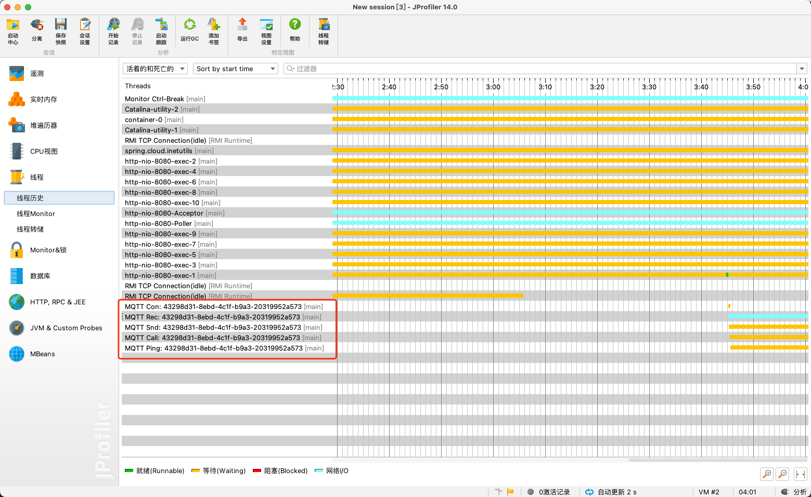
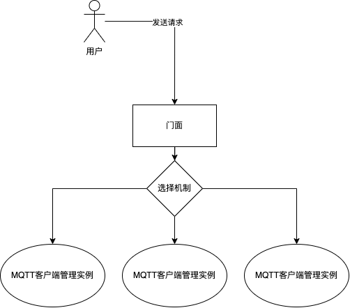
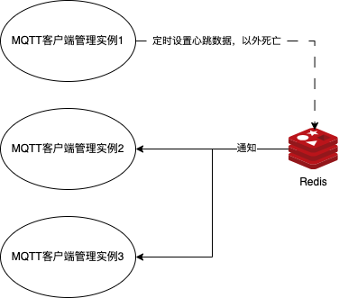

# MQTT 客户端管理方案

在物联网项目开发中，MQTT 协议是应用层协议，而MQTT客户端在其中承担了数据传输的职责，因此客户端的管理就显得尤为重要。

## 限制

1. 一个应用程序能够承载的MQTT客户端数量是有限量的。以Java为例，默认情况下，创建一个MQTT客户端在不做任何操作的情况下需要使用5个线程。

> **不考虑系统限制，可以通过如下公式计算，得出最大线程数量**
> 线程数量=（机器本身可用内存-JVM分配的堆内存）/Xss的值，比如我们的容器本身大小是8G,堆大小是4096M,走-Xss默认值，可以得出 最大线程数量：4096个。

2. 每个MQTT客户端存活的时间跨度大，物联网项目中一个MQTT客户端往往会持续运行几年，因此在方案设计阶段需要考虑到未来的扩容问题。

## 方案设计

针对限制内容最重要的设计元素有如下内容：

1. 通过配置文件限制当前应用能够创建的最大MQTT客户端数量。
2. 能够创建多个应用实例，并且支持负载均衡、故障转移。

上述两点中第一点是较为容易实现的，通过配置文件限制当前应用能够创建的最大MQTT客户端数量。最大的难度在于第二点，如何实现多个应用实例之间负载均衡、故障转移。

### 负载均衡

本负载均衡方案有一个前置条件：认为每个MQTT客户端做的行为相同，不会出现出现某些MQTT客户端执行内容过重的情况。

在这个前置条件下，负载均衡策略可以设计的极为简单：从所有的应用实例中选择使用数量最小的节点创建MQTT客户端。

> 使用数量=最大MQTT客户端数量-已创建MQTT客户端数量

请不要忘了MQTT客户端的执行内容可以相同，但什么时候执行却是不相同的。原因是物理设备在上报数据的时候会存在时间差异。因此一个复杂的负载均衡算法可以通过如下内容进行权重组合。

$$
\text{剩余容量比例} = \frac{\text{最大MQTT客户端数量} - \text{当前MQTT客户端数量}}{\text{最大MQTT客户端数量}}
$$

$$
\text{CPU负载比例} = \frac{\text{当前CPU使用率}}{100}
$$

$$
 \text{内存负载比例} = \frac{\text{当前内存使用量}}{\text{最大内存容量}} 
$$

$$
\text{负载分数} = w_1 \times \text{剩余容量比例} + w_2 \times \text{CPU负载比例} + w_3 \times \text{内存负载比例}
$$

其中: $w_1$,$w_2$和 $w_3$ 分别是剩余容量比例、CPU负载比例和内存负载比例的权重。最终可以根据计算出的负载分数，选择分数最低的应用实例作为新MQTT客户端的创建节点。

### 横向扩容

在负载均衡方案中，我们假设了MQTT客户端的行为是相同的，因此当需要扩容的时候，只需要增加应用实例的数量即可。

横向扩容时机：单个应用实例中MQTT客户端使用量占到80%的时候触发扩容。

> 注意: 应用实例中可以采用消息通知机制告知运维人员或者自动化程序创建新的应用实例。

注意:
1. 图中门面可以是Nginx、应用程序等任何可以与MQTT客户端管理实例产生网络通讯的组件。
2. 选择机制是在MQTT客户端管理实例中的并不是一个单独的程序

### 故障转移

故障转移是为了在出现以外的时候保证MQTT客户端的正常运行。这里主要假设两种故障的情况
1. 使用 EMQX 将MQTT客户端剔除（认为这是一个误操作，只针对在集群内部创建出来的MQTT是误操作）。有关误操作主要使用MQTT客户端的离线通知机制，以Java程序为例，`MqttCallback#connectionLost`方法会在MQTT客户端断开连接的时候被调用，因此可以作为判断是否是误操作的依据。

2. 应用实例意外死亡，导致该应用实例中的MQTT客户端全部被销毁。针对此项问题可以进行的操作有如下几种实现方案：
   1. 通过外部程序对应用实例进行监控，如果发现应用实例死亡则触发故障转移机制。注意：此方案需要额外维护一个监控程序，并且需要保证监控程序的正常运行。
   2. 使用类似Redis的工具实现过期监听，当应用实例中MQTT客户端过期后，触发故障转移机制。注意：每个应用实例需要有一个额外的定时任务周期性的写入心跳数据到Redis中，会增加一个线程消耗。

    

