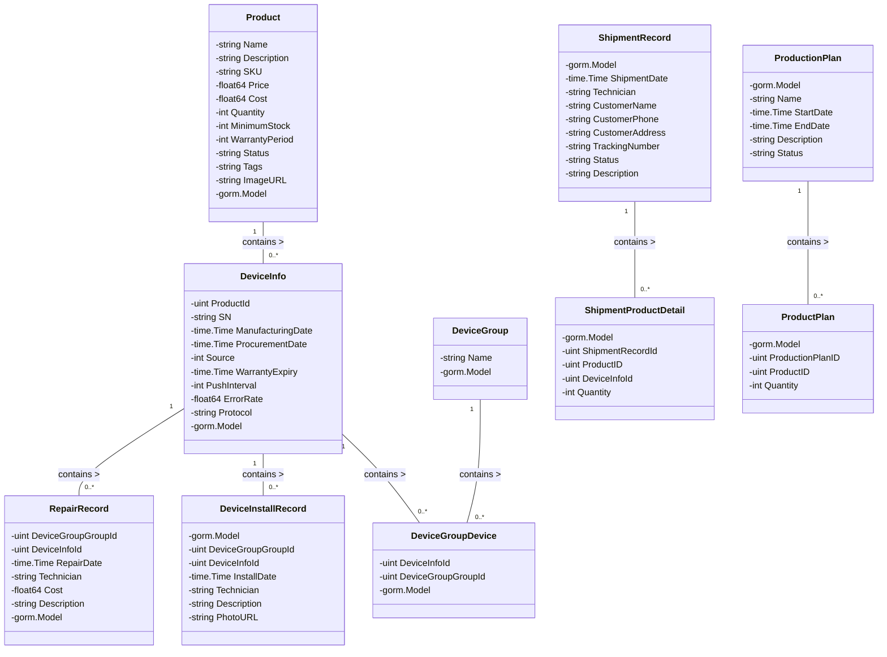

# 生命周期管理

## 业务逻辑

逻辑1：

1.   创建产品
2.   创建生产计划
     1.   生产计划中需要选择具体的产品和数量
3.   生产计划确认完成后可以在设备列表中看到本次生产计划生产的设备信息

逻辑2：

1.   创建设备组
2.   将设备列表中的设备自由选择到一个组中进行关系建立

逻辑3：

1.   创建发货记录
2.   选择产品
3.   选择具体设备

>   注意: 这块选择具体设备还没有程序支持

逻辑4：

1.   创建维修记录（这是一个普通的增删改查）

逻辑5：
1. SIM 卡管理（这是一个普通的增删改查）

