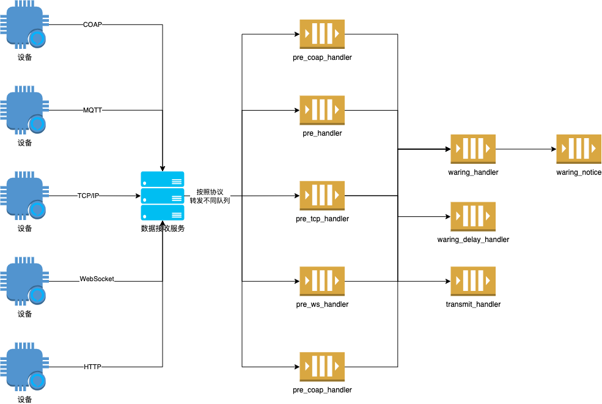

# 数据流转链路


## 核心数据结构

物联网项目的现场安装方式：

1. 物理设备可以直接进行网络通讯，将数据进行上报
2. 物理设备需要通过网关设备才能够完成数据上报

针对这两种安装模式，提出本系统内部的核心数据结构。

```go
type DataRowList struct {
	Time      int64     `json:"time"`       // 秒级时间戳
	DeviceUid string    `json:"device_uid"` // 能够产生网络通讯的唯一编码
	IdentificationCode string `json:"identification_code"` // 设备标识码
	DataRows  []DataRow `json:"data"`
	Nc        string    `json:"nc"`
}
type DataRow struct {
	Name  string `json:"name"`
	Value string `json:"value"`
}


```

第一种安装方式下 `DeviceUid` 和 `IdentificationCode` 相同，第二种安装方式下则不相同。


> 注意: 这个数据结构并不是设备上报的数据结构，而是内部流转的数据结构。设备上报后需要通过解析脚本解析为本数据结构。


下面以MQTT客户端上报数据为例，`DeviceUid` 这个字段是本系统中MQTT客户端的唯一标识。这个标识在创建MQTT客户端的时候就已经确定，因此用户只需要拷贝相关唯一标识即可。另外如果不采用MQTT
的通配符订阅模式，`IdentificationCode` 需要和 `DeviceUid` 设置为相同的。其他协议处理模式相同。


## 核心数据流转链路

下图为设备上报数据到处理数据的整个完整过程。

1.   设备设备通过COAP、MQTT、TCP/IP、WebSocket和HTTP发送数据到指定的服务器
2.   服务器在收到数据后会根据不同的上报协议转发到不同的消息队列中。

| 上报协议  | 消息队列         |
| --------- | ---------------- |
| COAP      | pre_coap_handler |
| MQTT      | pre_handler      |
| TCP/IP    | pre_tcp_handler  |
| WebSocket | pre_ws_handler   |
| HTTP      | pre_http_handler |


3.   消息队列会找到对应的解析脚本将原始报文转换为 `DataRowList` 数据。`pre_xxx_handler` 中会完成数据存储
4.   经过 `pre_xxx_handler` 的队列后将数据放入到 `waring_handler` 、`waring_delay_handler` 和 `transmit_handler` 消息队列完成后续的数据处理。其中 `waring_handler` 判断为报警的数据会放入通知队列 `waring_notice` 





## 数据存储

本项目采用Influxdb2作为数据存储工具。整体设计方案如下。

1.   `bucket` 为配置文件内容
2.   `measurement` 计算规则:  `协议_${DeviceUid}_${IdentificationCode}`
3.   `field`详细内容如下

| 数据字段                  | 数据值                                                   |
| ------------------------- | -------------------------------------------------------- |
| storage_time              | 系统存储时间，此数据为系统生成，写入influxdb之前的时间。 |
| push_time                 | 数据上报时间，此数据从`${DataRowList.Time}`中获取        |
| DataRowList.DataRows.Name | DataRowList.DataRows.Value                               |

