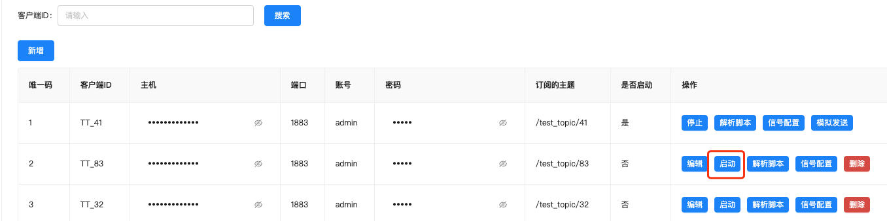
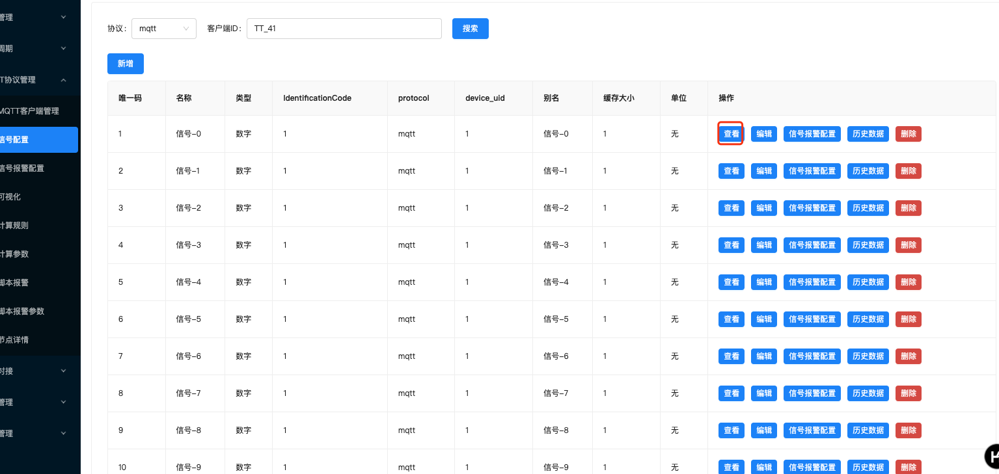
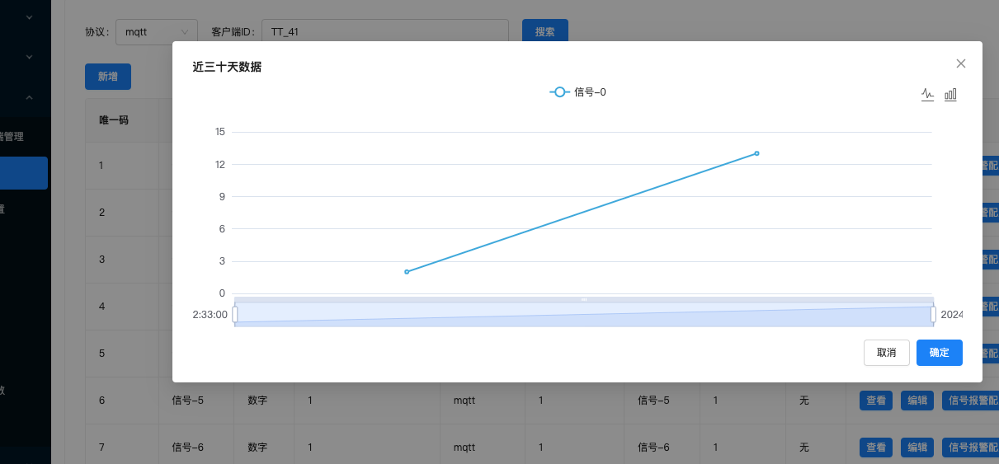

# 部署文档


## 前置条件
- [x] 安装 Docker
- [x] 安装 Docker Compose 
- [x] 下载本项目 

## 环境搭建步骤

```shell
cd $project_path/docker
sh env-start.sh 
```

> 如果访问 docker 仓库慢可以考虑使用如下地址
> 1.   https://docker.m.daocloud.io/
> 2.  注册阿里云开通容器服务（这是一个免费的）
> 🕒 请耐心等待，下载需要一些时间。

当看到如下内容时则安装完成

```shell
[+] Running 71/18
 ✔ telegraf Pulled                                                                                                               221.0s
 ✔ mongo-express Pulled                                                                                                          205.8s
 ✔ emqx1 Pulled                                                                                                                  402.3s
 ✔ mongodb Pulled                                                                                                                130.6s
 ✔ redis Pulled                                                                                                                  261.9s
 ✔ influxdb Pulled                                                                                                               281.5s
 ✔ rabbitmq Pulled                                                                                                               150.7s
 ✔ mysql Pulled                                                                                                                  346.7s

[+] Running 10/10
 ✔ Network env_iot-net       Created                                                                                               0.1s
 ✔ Volume "env_influxdbv2"   Created                                                                                               0.0s
 ✔ Container emqx1           Started                                                                                               3.9s
 ✔ Container rabbitmq        Started                                                                                               3.4s
 ✔ Container env-redis-1     Started                                                                                               3.9s
 ✔ Container env-influxdb-1  Started                                                                                               2.8s
 ✔ Container mysql8          Started                                                                                               2.8s
 ✔ Container mongo-express   Started                                                                                               3.9s
 ✔ Container mongodb         Started                                                                                               2.7s
 ✔ Container env-telegraf-1  Started                                                                                               2.5s
环境后台准备中...,请稍后
```

注意：

1. 请务必检查每个服务是否启动成功，如果没有启动成功请重新执行 `sh env-start.sh`

## 项目部署步骤

启动之前请确认宿主机IP，并修改 
1. [.env.docker](../ant-vue/.env.docker) 中的 `VITE_APP_API_URL` 属性
2. [app](../docker/app) 目录下的 172.17.0.1 改为宿主机IP （如果你存在 `172.17.0.1` IP 可以不做修改）

```shell
cd $project_path/docker
sh app-start.sh
```

部署完成后访问: http://localhost:8080/ 即可看到项目

接口文档：http://localhost:8005/swagger/index.html


## 端口使用情况

### 环境相关端口
| 服务名称       | 容器端口 | 宿主机端口 | 备注         |
|----------------|-----------|-----------|--------------|
| influxdb       | 8086      | 8086      | InfluxDB 数据库 |
| mongodb        | 27017     | 27017     | MongoDB 数据库   |
| mongo-express  | 8081      | 8181      | MongoDB 管理界面 |
| emqx1          | 1883      | 1883      | EMQ X MQTT Broker |
| emqx1          | 8083      | 8083      | EMQ X Dashboard |
| emqx1          | 8084      | 8084      | EMQ X WebSocket |
| emqx1          | 8883      | 8883      | EMQ X MQTTS (Secure) |
| emqx1          | 18083     | 18083     | EMQ X Dashboard Secure |
| mysql          | 3306      | 3306      | MySQL 数据库    |
| rabbitmq       | 5672      | 5672      | RabbitMQ AMQP   |
| rabbitmq       | 15672     | 15672     | RabbitMQ Management Console |
| redis          | 6379      | 6379      | Redis 数据库   |


### 应用相关端口


| 服务名称             | 容器端口 | 宿主机端口 | 备注               |
|----------------------|-----------|-----------|--------------------|
| iotgomqtt1           | 8006      | 8006      | Go Iot MQTT Service |
| iotgomqtt2           | 8007      | 8007      | Go Iot MQTT Service |
| iotgomqtt3           | 8008      | 8008      | Go Iot MQTT Service |
| iotgomq-pre_handler  | 29002     | 8001      | Go Iot MQ Pre Handler |
| iotgomq-calc_handler | 29001     | 8002      | Go Iot MQ Calc Handler |
| iotgomq-waring_handler | 29003     | 8003      | Go Iot MQ Waring Handler |
| iotgomq-wd_handler   | 29004     | 8004      | Go Iot MQ WD Handler |
| iotgoproject         | 8080      | 8005      | Go Iot Project     |
| iot-admin-vue        | 80        | 8080      | Go Iot Admin Vue   |


## 模拟数据

注意：

1.   如下模拟操作只能执行一次，第二次执行请确保环境也是空的。
2.   这个测试链路请不要再公网执行，带宽会用很多。如果需要执行请改变传输内容


### MQTT 客户端

执行下面JS 将创建100个MQTT客户端

```javascript
function createMqttClient(i) {
    const myHeaders = new Headers();
    myHeaders.append("Content-Type", "application/json");

    const raw = JSON.stringify({
        "client_id": "TT_" + i ,
        "host": "${your_ip}",
        "port": 1883,
        "username": "admin",
        "password": "admin",
        "subtopic": "/test_topic/" + i
    });

    const requestOptions = {
        method: "POST",
        headers: myHeaders,
        body: raw,
        redirect: "follow"
    };

    fetch("http://${your_ip}:8005/mqtt/create", requestOptions)
        .then((response) => response.text())
        .then((result) => console.log(result))
        .catch((error) => console.error(error));
}

function callCreateMqtt() {
    for (let i = 0; i < 100; i++) {

        createMqttClient(i);

    }


}

callCreateMqtt()
```

### 设置脚本
执行下面JS设置100个MQTT客户端的解析脚本

```javascript

function setScript(i ){
    const myHeaders = new Headers();
    myHeaders.append("Content-Type", "application/json");

    const raw = JSON.stringify({
        "id": i,
        "script": "function main(nc) {\n   var result = JSON.parse(nc);\n    return [result];\n}"
    });

    const requestOptions = {
        method: "POST",
        headers: myHeaders,
        body: raw,
        redirect: "follow"
    };

    fetch("http://${your_ip}:8005/mqtt/set-script", requestOptions)
        .then((response) => response.text())
        .then((result) => console.log(result))
        .catch((error) => console.error(error));
}


function callSetScript(){
    for (let i = 0; i < 100; i++) {

        setScript(i );

    }
}


callSetScript()
```


### 设置信号

执行下面 JS 脚本，控制台会生成需要插入到数据库的SQL语句，如果你是Linux系统可以执行 `node demo.js > demo.txt` 将内容都写入到demo.txt

```javascript

function c(mqtt_client_id, sid) {
    var now = new Date();
    var formattedNow = now.toISOString().slice(0, 19).replace('T', ' ');

    var cc = `INSERT INTO \`signals\` (\`protocol\`, \`identification_code\`, \`device_uid\`, \`name\`, \`alias\`, \`type\`, \`unit\`, \`cache_size\`, \`created_at\`, \`updated_at\`, \`deleted_at\`) 
              VALUES ('mqtt', '${mqtt_client_id}', ${mqtt_client_id}, '信号-${sid}', '信号-${sid}', '数字', '无', 1, '${formattedNow}', '${formattedNow}', NULL);`;
    console.log(cc);
}

function main(){
    for (let i = 0; i <100; i++) {
        for (let j = 0; j <200; j++) {
            c(i+1 , j);
        }
    }
}
```

将上述内容插入到 iot 数据库中 ，执行信号缓存

```shell
http://${your_ip}:8005/signal/initCache
```


### 模拟客户端
进入数据库执行如下sql语句

```sql
select subtopic , ID FROM mqtt_clients
```

将上述执行结果拷贝到 [1.txt](../test/1.txt) 中，使用 `\t` 做分割

修改 [v.go](../test/v.go) 两项内容：
1. ip 为你的本地IP
2. 时间间隔

```go
	for {

		for _, vc := range fime {
			publish(client, vc.Topic, vc.ID, vc.ID)

		}
		time.Sleep(1*time.Second)
	}
```


执行下面命令启动模拟服务

```shell
cd $project_path/test
docker-compose up -d 
```

确认启动成功后，访问:http://localhost:8080/mqtt-management/index 





1.   点击启动
2.   点击同行的信号配置会进入新页面




3.   点击查看即可看到数据



