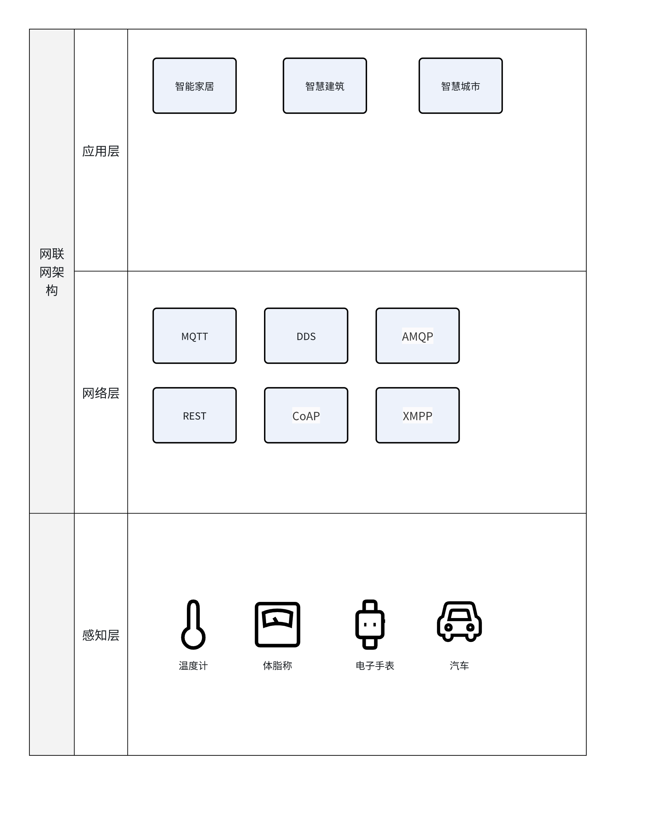

# 物联网基础知识

本章将介绍有关物联网相关的基础知识，包括物联网的定义、物联网三层架构模型。

## 什么是物联网

物联网（Internet of Things，简称IoT）是一个将物理世界与互联网连接起来的概念，它通过嵌入传感器、软件和网络连接到日常物品中，使得这些物品能够收集和交换数据。这里的“物”不仅包括传统的电子设备，如智能手机和电脑，还包括各种新型设备，如智能手表、家庭自动化设备、工业机器、医疗设备等。

IoT技术的核心在于实现设备间的互联互通，以及数据的实时收集和分析。这使得物联网能够提供智能化的服务和解决方案，从而提高效率、节约资源并改善生活质量。例如，在智能家居领域，IoT技术可以使家庭设备相互协作，自动调节室内温度、照明和安全系统，提升居住的舒适度和安全性。

此外，物联网在工业、农业、医疗、交通等多个领域都有广泛的应用。在工业4.0的背景下，IoT技术与大数据分析、人工智能等技术相结合，推动了智能制造和智能工厂的发展。在农业领域，通过使用传感器监测土壤湿度、温度等环境因素，可以更精确地管理作物生长，提高产量。在医疗领域，IoT设备可以远程监控患者的健康状况，及时提供必要的医疗干预。

## 物联网架构

物联网架构通常由三个主要层次构成，分别是**感知层**、**网络层**和**应用层**。这种分层的设计使得物联网系统能够高效地处理来自各种设备的数据，并提供多样化的服务。常见的三层架构如图所示。

1. **感知层**：这是物联网架构的基础，负责收集物理世界的数据。感知层由各种传感器组成，它们可以检测温度、湿度、光照、运动、声音等环境参数。此外，感知层还包括RFID标签和扫描器，用于识别和追踪物品。这些设备通常具有低功耗和小型化的特点，能够部署在各种环境中。
2. **网络层**：网络层负责将感知层收集的数据传输到应用层。它包括各种通信技术，如Wi-Fi、蓝牙、ZigBee、蜂窝网络（4G/5G）等。网络层确保数据的传输是安全和可靠的，同时，它还负责数据的初步处理，如数据聚合和压缩，以减少传输延迟和带宽消耗。
3. **应用层**：应用层是物联网架构的顶层，它处理来自网络层的数据，并为用户提供实际的应用和服务。应用层可以包括数据分析、智能决策支持、用户界面和业务逻辑。通过应用层，用户可以访问和管理物联网设备，获取实时信息，并根据数据分析结果做出决策。

## 感知层

感知层是物联网架构的底层，它扮演着至关重要的角色，负责收集和捕获物理世界的信息。这一层的核心功能是识别物体和采集数据，它包括各种传感器、读写器、摄像头等设备，这些设备是实现物联网智能化和自动化的基础。

随着技术的进步，感知层设备正变得更加智能和高效。例如，边缘计算设备能够在数据源附近进行初步的数据处理和分析，减少对中心服务器的依赖，提高响应速度。同时，低功耗广域网（LPWAN）技术的发展，使得感知层设备能够在更远的距离和更低的能耗下工作，为物联网的大规模部署提供了可能。

以下是一些常见的感知层设备及其用途：

| 设备类型       | 用途                     |
|------------|------------------------|
| 温度传感器      | 测量环境温度                 |
| 湿度传感器      | 测量环境湿度                 |
| 压力传感器      | 测量压力值，常用于工业监测          |
| 光传感器       | 测量光照强度                 |
| 运动传感器      | 检测运动或存在，常用于安全系统        |
| RFID标签和读写器 | 用于自动识别和跟踪带有RFID标签的物品   |
| 摄像头        | 安全监控、交通监控、人脸识别等        |
| 智能卡读卡器     | 读取智能卡上的信息，常用于门禁系统      |
| 环境监测设备     | 监测空气质量、水质参数等           |
| 智能穿戴设备     | 监测心率、步数、睡眠质量等          |
| 智能仪表       | 远程读取能源消耗数据，如电表、水表、燃气表  |
| GPS设备      | 定位和导航，常用于车辆跟踪和个人定位     |
| 执行器        | 响应传感器的输入，执行物理操作        |
| 数据采集器      | 从传感器收集数据，并转换成适合网络传输的格式 |
| 边缘计算设备     | 在数据源附近进行数据处理和分析        |
| 智能锁        | 提供远程控制和访问权限管理          |
| 温湿度记录器     | 记录特定环境的温湿度变化           |
| 振动传感器      | 监测设备振动，用于预测性维护         |
| 声音传感器      | 测量声音强度，用于噪音监测或安全警报     |

## 网络层

网络层是连接感知层和应用层的中间层，它负责数据的传输、路由、管理和安全。网络层的主要功能是将感知层收集到的数据传输到应用层，同时确保数据的可靠性、安全性和有效性。

### MQTT

MQTT（Message Queuing Telemetry Transport）是一种轻量级的消息传输协议，它被设计用于连接带宽有限、延迟较高、不稳定的网络环境中的设备。以下是MQTT的一些主要特点以及它的优缺点。

**MQTT特点**

1. **轻量级**：MQTT协议的设计非常简洁，易于实现，适合于低功耗设备。

2. **发布/订阅模式**：MQTT使用发布/订阅模式，消息发布者（发布者）不会将消息直接发送给订阅者，而是将消息发布到一个主题，订阅者根据需要订阅感兴趣的主题。

3. 多种QoS级别，MQTT支持三种服务质量（QoS）级别，允许开发者根据应用需求选择消息传输的可靠性：

    - QoS 0：最多一次传输，消息可能会丢失。
    - QoS 1：至少一次传输，确保消息至少到达一次。
    - QoS 2：只有一次传输，确保消息只到达一次。

4. **连接保持**：即使在网络不稳定的情况下，MQTT也能保持客户端和服务器之间的连接。

5. **会话保持**：MQTT支持会话保持，可以确保消息在客户端重新连接后不会丢失。

6. **小数据包**：MQTT协议的消息头部很小，这使得它非常适合于带宽受限的环境。

7. **易于实现**：由于协议简单，它易于在各种设备上实现，包括嵌入式系统。

**MQTT优点**：

1. **低带宽消耗**：由于协议的轻量级特性，MQTT在带宽受限的网络中表现良好。
2. **低功耗**：适合于电池供电的设备，因为可以减少网络活动，延长电池寿命。
3. **可扩展性**：能够支持大量的客户端连接，适用于大规模部署。
4. **灵活性**：通过QoS级别，开发者可以根据应用需求调整消息传输的可靠性。
5. **跨平台**：MQTT可以在多种操作系统和平台上运行，具有很好的兼容性。

**MQTT缺点**：

1. **不支持路由**：MQTT协议本身不支持消息的路由功能，所有的消息都必须发送到中心服务器。
2. **安全性依赖于TLS/SSL**：MQTT协议本身不提供加密，安全性依赖于TLS/SSL的实现。
3. **可能的消息丢失**：在QoS 0级别下，消息可能会丢失，需要应用程序层面进行处理。
4. **主题名称限制**：MQTT的主题名称有一些限制，例如不能包含特殊字符，这可能会限制其灵活性。

### CoAP

CoAP（Constrained Application Protocol）是一种专为物联网（IoT）设计的协议，它基于REST架构，旨在为资源受限的设备提供有效的通信方式。CoAP协议的详细规范定义在 [RFC 7252](https://datatracker.ietf.org/doc/html/rfc7252)。

CoAP特点：

1. **轻量级**：CoAP协议的数据包格式简洁，有效降低了数据传输量和处理复杂度，减少了设备资源消耗。
2. **基于REST**：CoAP遵循RESTful架构风格，使用URI来标识资源，支持GET、POST、PUT、DELETE等HTTP方法的简化版本。
3. **二进制格式**：与HTTP不同，CoAP是二进制格式的，这使得它比HTTP更加紧凑，最小长度只有4字节。
4. **支持可靠传输**：CoAP支持消息确认和重传机制，确保数据可靠到达。
5. **支持IP多播**：CoAP协议支持IP多播，可以同时向多个设备发送请求。
6. **非长连接通信**：适用于低功耗物联网场景，不需要保持长连接。
7. **安全性**：CoAP支持通过DTLS（Datagram Transport Layer Security）协议进行加密和认证，保证数据传输的安全性。

CoAP优点：

1. **适用于资源受限环境**：由于物联网设备通常具有有限的计算能力和内存，CoAP的轻量级特性使其非常适合这类设备。
2. **高效传输**：采用UDP传输协议，提高了数据传输效率，适用于实时性要求较高的物联网场景。
3. **易扩展**：可以通过设计合适的URI来方便地扩展指令或删减指令，满足不同设备的需求。
4. **异步通信**：支持异步通信模式，设备可以在不需要保持长连接的情况下进行数据传输和交互。
5. **跨多种网络**：CoAP可以在多种网络中运行，如IPv4、IPv6、6LoWPAN、LoRaWAN。

CoAP缺点：

1. **可靠性问题**：CoAP本身是基于UDP的，不是可靠协议，虽然通过消息确认和重传机制提供了一定的可靠性，但在高丢包率的网络环境下可能仍会出现消息丢失。
2. **兼容性**：CoAP相对于HTTP协议来说还比较新，因此在一些老旧的设备和系统中可能不支持CoAP协议，导致兼容性问题。
3. **处理开销**：虽然CoAP的消息头比HTTP短，但在资源受限的设备上，处理CoAP消息可能仍然存在一定的性能开销。
4. **网络限制**：由于CoAP依赖于DTLS进行安全通信，它可能不适用于不支持DTLS或UDP的网络环境。

### NB-IoT

NB-IoT（Narrow Band Internet of Things）是一种基于蜂窝网络的窄带物联网技术，属于低功耗广域网（LPWAN）技术之一，专为物联网应用设计。它通过使用授权频谱，提供低功耗、广覆盖、大连接数和较低的数据传输速率，适用于静态或移动缓慢的设备。

NB-IoT特点：

1. **低功耗**：NB-IoT设备可以使用电池供电，待机时间可长达10年。
2. **广覆盖**：NB-IoT提供改进的室内覆盖，比现有网络增益20dB，相当于提升了100倍覆盖区域的能力。
3. **大连接数**：NB-IoT一个扇区能够支持10万个连接。
4. **低成本模块**：预期单个连接模块的成本将不超过5美元。
5. **易于部署**：NB-IoT可以直接部署在现有的GSM、UMTS或LTE网络上，降低了部署成本和复杂性。
6. **优化的网络架构**：支持低时延敏感度、超低的设备成本和优化的网络架构26。

NB-IoT优点：

1. **海量接入**：NB-IoT技术支持大量设备接入，单小区基站可接入5万个终端设备。
2. **覆盖超强**：NB-IoT的覆盖能力是LTE的100倍，具有超大覆盖范围与超强穿透能力。
3. **成本低廉**：NB-IoT支持在现有的LTE网络上改造，降低了网络建设成本。
4. **稳定可靠**：能提供电信级的可靠性接入，稳定支撑IoT应用场景。

NB-IoT缺点：

1. **高延迟**：NB-IoT的传输时延较大，不适合实时性要求高的应用。
2. **小数据量**：NB-IoT适合传输小数据量，大数据量的传输不适合此技术。
3. **低速率**：NB-IoT的上行理论峰值速率为15.6Kbps，下行理论峰值速率为21.25Kbps，相对较低。
4. **低频次**：由于功耗和带宽限制，NB-IoT不适合频繁通信的应用。
5. **低移动性**：NB-IoT更适宜慢速移动的设备，移动速度限制在30km/h以内。
6. **模块成本**：尽管预期成本较低，但NB-IoT模块的价格相较于某些其他技术如ZigBee、LoRa等可能更高。

### ZigBee

ZigBee是一种基于IEEE 802.15.4标准的短距离、低功耗、低数据速率的无线通信技术。它主要用于简单的低功耗个人区域网络（PANs），适用于家庭自动化、工业自动化、医疗设备、智能能源等应用场景。

ZigBee特点：

1. **低功耗**：ZigBee设备设计为低功耗运行，能够在一节电池供电下工作数月甚至数年。
2. **低成本**：ZigBee协议简化，降低了对节点存储和计算能力的要求，芯片成本较低。
3. **低速率**：工作在20-250kbit/s的速率，适合传输少量数据。
4. **近距离**：点对点传输范围一般介于10-100米之间，通过增加发射功率或路由可以扩展传输距离。
5. **短时延**：从睡眠状态唤醒到工作状态的转换时间非常短，通常在15ms以内。
6. **网络容量大**：一个ZigBee网络可以支持多达65000个节点。
7. **高安全**：提供数据完整性检查和鉴权功能，支持AES加密。
8. **免执照频段**：在2.4GHz的ISM频段运行，无需支付额外的频谱使用费用。

**ZigBee优点**：

1. **低功耗**：适合长时间电池供电的应用场景。
2. **低成本**：简化的协议和较低的硬件要求降低了成本。
3. **网络灵活性**：支持多种网络拓扑结构，包括星状、树状和网状。
4. **安全性**：提供多层次的安全保护措施，包括AES加密。
5. **可靠性**：采用碰撞避免机制和数据确认机制，确保数据传输的可靠性。

**ZigBee缺点**：

1. **成本问题**：尽管芯片成本较低，但整个系统的部署成本可能不低，尤其是在需要大量节点的场景中。
2. **通信稳定性**：在家居环境中，信号可能会受到墙壁和其他障碍物的影响，导致通信不稳定。
3. **自组网能力**：虽然ZigBee支持自组网，但在一些固定设备的应用场景中，这一特性可能并不总是必需的，而且自组网过程可能会消耗额外的时间和资源。

### LoRa

LoRa（Long Range Radio）是一种低功耗广域网（LPWAN）技术，它使用基于扩频技术的无线信号传输，能够实现远距离通信。LoRa技术由美国Semtech公司开发，并且得到了LoRa联盟的推广和标准化，该联盟是一个开放的、非盈利的组织，致力于推动LoRa技术的发展和应用。

LoRa特点：

1. **长距离通信**：LoRa技术能够实现非常长的通信距离，覆盖范围可达数公里到数十公里，适合于需要远距离通信的物联网应用场景45。
2. **低功耗**：LoRa设备设计为低功耗，使得设备能够在电池供电下运行数年之久。
3. **广域覆盖**：LoRa网络提供广泛的覆盖范围，能够穿透障碍物，适用于室内外环境。
4. **抗干扰能力**：LoRa技术采用扩频调制技术，具有良好的抗干扰性和抗多径衰落能力。
5. **低成本**：LoRa技术的部署成本相对较低，设备价格也较为经济。
6. **开放标准**：LoRa是一种开放的通信标准，促进了生态系统的发展和创新。

LoRa优点：

1. **超长传输距离**：LoRa技术可以支持的通信距离非常长，通常可达数公里，甚至在理想条件下可达到数十公里。
2. **低功耗**：LoRa设备设计为低功耗，使得它们能够在电池供电的情况下运行数年，非常适合难以获取电源的远程监控和传感器网络。
3. **高容量**：LoRa网络可以支持大量的设备连接，理论上可以支持数十万个设备连接到单个网关。
4. **抗干扰性**：LoRa使用的扩频技术使其在复杂的无线环境中也能保持稳定可靠的通信连接，不易受到干扰。
5. **易于部署**：LoRa网关和节点的部署相对简单，不需要复杂的布线，可以快速扩展网络覆盖。
6. **开放性和标准化**：LoRa是基于开放标准的技术，LoRaWAN协议已经被广泛接受和实施，促进了不同设备和平台之间的互操作性。
7. **安全性**：LoRaWAN协议支持端到端的加密，确保数据传输的安全性。

LoRa缺点：

1. **较低的数据传输速率**：LoRa的传输速率较低，通常在几百bps到几十kbps之间，不适合传输大量数据或需要高带宽的应用。
2. **有限的移动性**：LoRa主要设计用于固定或慢速移动的设备，快速移动的设备可能会遇到连接不稳定的问题。
3. **频段限制**：LoRa主要运行在免费的ISM频段，但在不同国家和地区，可用的频段和功率限制可能有所不同，这可能影响其性能和应用。
4. **网络拥塞**：在高密度部署的场景下，如果大量设备同时尝试发送数据，可能会引起网络拥塞。
5. **隐私问题**：虽然LoRaWAN支持加密，但在某些配置下，数据包可能被截获和解码，需要正确实施安全措施以保护隐私。

### LwM2M

LwM2M（Lightweight Machine to Machine）是一种专为物联网（IoT）设计的协议，它支持设备管理和服务交付。LwM2M协议由OMA（Open Mobile Alliance）组织制定，旨在简化物联网设备的管理和操作，适用于各种类型的机器到机器（M2M）应用。

LwM2M特点：

1. **轻量级**：LwM2M协议设计轻量级，适合资源受限的设备，如传感器和小型控制器。
2. **基于REST**：LwM2M协议基于REST架构风格，使用HTTP或CoAP作为传输协议，简化了实现和部署。
3. **设备管理**：LwM2M提供了一套设备管理功能，包括设备信息、连接性、固件更新等。
4. **服务交付**：LwM2M支持服务交付，允许远程配置和控制设备提供的服务。
5. **安全性**：LwM2M支持使用DTLS（Datagram Transport Layer Security）进行端到端加密，确保通信安全。
6. **可扩展性**：LwM2M协议具有良好的可扩展性，可以通过对象和资源来定义新的服务和功能。
7. **多客户端支持**：LwM2M允许设备同时与多个服务器通信，提高了灵活性。

LwM2M优点：

1. **简化的设备管理**：LwM2M提供了一套标准化的设备管理机制，简化了物联网设备的配置、更新和监控。
2. **跨平台和跨网络**：LwM2M可以在多种网络协议上运行，支持广泛的平台和设备。
3. **安全性**：通过DTLS支持，LwM2M确保了数据传输的安全性和完整性。
4. **易于集成**：LwM2M的设计易于与现有的网络基础设施和云服务集成。
5. **标准化**：作为OMA标准的一部分，LwM2M得到了业界的广泛认可和支持。

LwM2M缺点：

1. **相对较新**：LwM2M是一个相对较新的协议，可能还没有得到所有设备和平台的支持。
2. **复杂性**：LwM2M设计为轻量级，但在某些情况下，其对象和资源模型可能对开发者来说仍然相对复杂。
3. **依赖于网络环境**：LwM2M的性能和可靠性可能依赖于网络环境，如网络的稳定性和延迟。
4. **有限的带宽和资源**：在带宽和资源受限的环境中，LwM2M的性能可能受到限制。

### Modbus

Modbus是一种串行通信协议，最初由Modicon（现为施耐德电气的一部分）在1979年开发用于其可编程逻辑控制器（PLC）。Modbus已经成为工业自动化领域中广泛使用的协议之一，特别是在监控和数据采集系统（SCADA）中。

Modbus特点：

1. **简单性**：Modbus协议设计简单，易于在多种类型的设备和控制器之间实现。
2. **灵活性**：Modbus支持多种网络和传输介质，包括RS-232、RS-485、以太网等。
3. **开放性**：Modbus是一个开放的协议，这意味着任何人都可以实现它而不需要支付版权费用。
4. **功能丰富**：Modbus提供了多种功能码，支持读取和写入寄存器、输入状态、输出状态等。
5. **支持多种数据类型**：Modbus能够处理多种数据类型，包括数字和模拟信号。
6. **主从架构**：Modbus通常采用主从架构，一个主设备可以与多个从设备通信。

Modbus优点：

1. **广泛支持**：由于其开放性和简单性，Modbus得到了广泛的工业支持和应用。
2. **易于集成**：Modbus易于集成到现有的工业控制系统中，许多设备都支持Modbus协议。
3. **成本效益**：由于不需要支付版权费用，Modbus协议的实现成本较低。
4. **标准化**：Modbus协议有明确的标准（如Modbus/RTU和Modbus/TCP），这有助于确保不同设备之间的兼容性。

Modbus缺点：

1. **有限的安全性**：Modbus协议本身不提供加密或认证机制，这可能使其容易受到安全威胁。
2. **速度较慢**：与其他一些现代通信协议相比，Modbus在数据传输速度上可能较慢。
3. **不适合大数据量**：Modbus协议在处理大数据量传输时效率不高，特别是在Modbus/RTU模式下。
4. **主从限制**：Modbus的通信模型限制了网络中只能有一个主设备，这可能限制了某些应用场景的灵活性。
5. **网络规模限制**：Modbus网络的规模受限于网络架构和实现方式，不适合大规模分布式系统。

## 应用层

在物联网的多层面架构中，应用层扮演着至关重要的角色。它不仅直接与用户接触，而且负责将从网络层传输过来的数据转换为用户能够理解和使用的形式。本章将探讨应用层如何通过多样化的服务和应用，满足不同用户的需求。

物联网领域常见应用方向可以查看表

| 应用领域       | 应用实例               | 描述                       |
|------------|--------------------|--------------------------|
| 智能家居       | 智能恒温器、智能灯泡、智能安防系统  | 提高居住舒适度和能源效率，增强家庭安全。     |
| 智能农业       | 土壤湿度监测、气候监测、无人机喷药  | 自动化灌溉，优化作物生长条件，提高农业生产效率。 |
| 智能工业（IIoT） | 生产流程优化、设备预测性维护     | 提高工业生产的安全性和效率，减少停机时间。    |
| 智能电网       | 远程电力抄表、电网优化        | 提高计费效率，优化电力分配，支持可再生能源集成。 |
| 远程医疗       | 健康监测、远程诊断          | 通过远程医疗服务，提高医疗服务的可及性。     |
| 智慧城市       | 智能交通管理、环境监测、公共安全系统 | 提高城市管理效率，改善居民生活质量。       |
| 零售业        | 智能货架、自动结账系统、客户行为分析 | 提升顾客购物体验，优化库存管理。         |
| 供应链管理      | 货物跟踪、物流优化          | 提高供应链透明度，减少物流成本。         |
| 能源管理       | 能耗监测、节能减排          | 优化能源使用，支持绿色能源和节能减排。      |
| 车联网（IoV）   | 交通流量监控、车辆远程诊断      | 提高道路使用效率，提前发现车辆问题。       |
| 可穿戴设备      | 健康监测、运动追踪          | 追踪个人健康数据，记录运动表现。         |
| 环境监测       | 空气质量监测、生态系统变化监测    | 实时监控环境质量，保护自然环境。         |

### 智能家居

智能家居是物联网技术在家庭环境中的一个具体应用。它通过连接家庭中的各种设备和系统，实现远程控制、自动化管理以及居住环境的优化。

智能家居系统通常包含以下关键技术：

1. **智能恒温器**：自动调节家庭的温度，提高舒适度和能源效率。
2. **智能照明**：根据需要自动开关灯光，调节亮度和颜色。
3. **智能安防系统**：包括监控摄像头、门窗传感器、烟雾报警器等，增强家庭安全。
4. **语音助手**：如Amazon Echo或Google Home，通过语音命令控制家中的智能设备。
5. **智能家电**：如智能冰箱、洗衣机等，具备远程控制和自动管理功能。

智能家居的应用场景非常广泛，包括但不限于：

1. **节能管理**：通过智能恒温器和智能照明系统，实现能源的节约。
2. **安全监控**：通过安防系统实时监控家庭安全，及时响应异常事件。
3. **便捷生活**：通过语音助手或手机应用，远程控制家中的设备。
4. **健康生活**：通过智能穿戴设备和健康监测系统，关注家庭成员的健康状况。
5. **娱乐系统**：通过智能电视和音响系统，提供丰富的娱乐体验。

### 智能农业

智能农业是利用现代信息技术，对农业生产过程进行智能化管理和精准化操作的现代农业模式。它通过集成传感器、无线通信、云计算、数据分析等技术，实现对农业生产环境的实时监控和精确管理。

智能农业系统通常包含以下关键技术：

1. **土壤湿度监测**：通过土壤湿度传感器监测土壤水分，指导灌溉。
2. **气候监测**：利用气象站收集温度、湿度、光照、降雨等气候数据。
3. **无人机技术**：使用无人机进行作物监测、病虫害防治和喷药。
4. **卫星遥感**：利用卫星图像监测作物生长情况和土地利用变化。
5. **数据分析**：应用大数据分析和人工智能算法，对农业数据进行深入分析，优化生产决策。
6. **智能灌溉系统**：根据土壤湿度和气候数据自动调节灌溉量和时间。

智能农业的应用场景包括但不限于：

1. **精准农业**：通过精确控制种植条件，提高作物产量和质量。
2. **资源管理**：优化水、肥料等农业资源的使用，减少浪费。
3. **病虫害防治**：早期发现病虫害并采取相应措施，减少损失。
4. **作物监测**：实时监测作物生长状况，及时调整种植策略。
5. **供应链优化**：从生产到销售的全过程监控，提高供应链效率。

智能农业带来了许多优势，包括：

1. **提高效率**：自动化和智能化的管理系统提高了农业生产的效率。
2. **节约资源**：精准农业技术有助于减少水和肥料的浪费。
3. **增加产量**：通过优化种植条件，提高作物产量。
4. **提高食品安全**：更好的监控和管理有助于提高食品安全。
5. **适应气候变化**：通过数据分析，更好地应对气候变化带来的挑战。

### 智能工业

智能工业，也被称作工业4.0，是指通过集成先进的信息技术与制造技术，实现生产过程的智能化、自动化和最优化。它强调的是制造系统的灵活性、自适应性、资源效率和人机协作。

智能工业的发展依赖于以下关键技术：

1. **物联网(IoT)**：通过传感器和执行器收集数据，实现设备的互联互通。
2. **大数据分析**：对收集到的大量数据进行分析，以优化生产过程。
3. **人工智能(AI)和机器学习**：使机器能够自主学习和做出决策。
4. **数字孪生(Digital Twin)**：创建物理对象的虚拟副本，用于测试和优化。
5. **边缘计算**：在数据源附近进行数据处理，减少延迟。
6. **机器人自动化**：自动化执行重复性或危险的任务。
7. **增材制造**：如3D打印技术，用于快速原型开发和小批量生产

智能工业的应用场景广泛，包括但不限于：

1. **生产流程优化**：通过实时数据分析优化生产效率。
2. **预测性维护**：利用AI预测设备故障，减少停机时间。
3. **供应链管理**：实时监控供应链状态，提高响应速度。
4. **定制化生产**：快速调整生产线以满足个性化需求。
5. **质量管理**：自动化检测产品缺陷，提高产品质量。
6. **能源管理**：优化能源使用，减少浪费。

智能工业带来的好处包括：

1. **提高生产效率**：自动化和智能化减少了生产时间。
2. **降低运营成本**：预测性维护和能源管理减少了额外开支。
3. **增强灵活性和适应性**：快速响应市场变化和个性化需求。
4. **提升产品质量**：自动化检测和质量控制减少了缺陷。
5. **促进创新**：数字孪生和模拟技术加速了新产品的开发。

### 智慧城市

智慧城市是一个利用物联网、大数据、云计算、人工智能等技术，对城市运行的各个方面进行智能化管理和服务的新型城市模式。它通过收集和分析城市中产生的大量数据，优化资源配置，提高城市管理的效率和响应速度。

智慧城市的构建依赖于以下关键技术：

1. **物联网(IoT)**：连接城市中的各种设备和传感器，实时收集数据。
2. **大数据分析**：对城市产生的大数据进行分析，提取有价值的信息。
3. **云计算**：提供数据存储、处理和分析的平台。
4. **人工智能(AI)**：使系统能够自主学习和做出智能决策。
5. **地理信息系统(GIS)**：用于城市空间数据的管理和分析。
6. **智能交通系统**：优化交通流量，减少拥堵。

智慧城市的应用场景涵盖城市的多个方面，包括：

1. **智能交通管理**：通过智能交通信号和车辆监控系统，提高交通效率。
2. **环境监测**：实时监测空气质量、水质等环境指标，及时响应污染问题。
3. **公共安全**：利用视频监控、智能分析等技术，提高城市的安全管理水平。
4. **能源管理**：优化能源分配，推广智能电网和可再生能源的使用。
5. **智慧医疗**：通过远程医疗和电子健康记录，提高医疗服务的质量和可及性。
6. **智能建筑**：利用自动化和智能化技术，提高建筑的能源效率和居住舒适度。

智慧城市带来的好处包括：

1. **提高效率**：优化城市资源配置，提高城市管理和服务的效率。
2. **节能减排**：通过智能能源管理和绿色出行，减少能源消耗和环境污染。
3. **提升生活质量**：通过智能服务，提高居民的生活质量和便利性。
4. **增强安全性**：通过智能监控和应急响应系统，提高城市的安全性。
5. **促进经济发展**：吸引投资，创造就业机会，促进经济的可持续发展。

