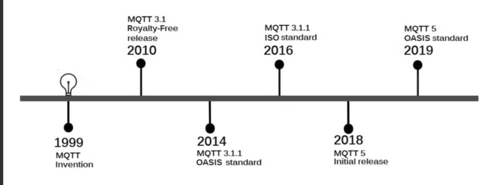
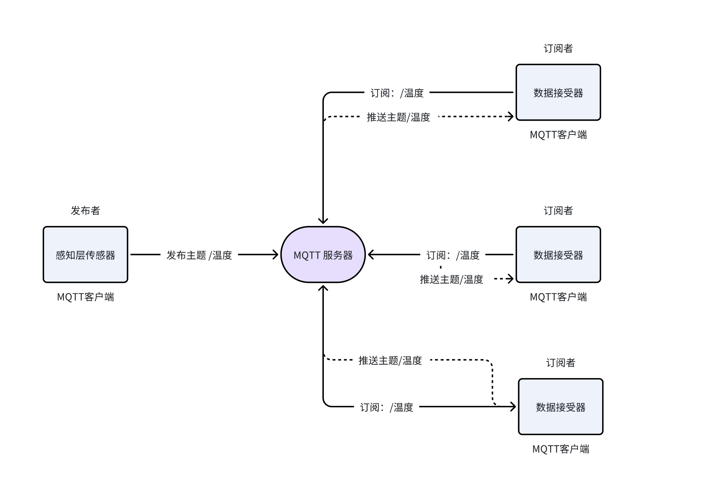

# MQTT 介绍

本节将对MQTT做进一步的深化学习。

## MQTT 是什么

MQTT（Message Queuing Telemetry Transport）是一种轻量级的、低带宽占用的、基于发布/订阅模式的消息传输协议。它被设计用于连接带宽有限、延迟较高、不稳定的网络环境，特别适用于物联网（IoT）场景。

### **MQTT 主要特点**

1. **轻量级和高效**：MQTT客户端体积小，资源消耗少，适合在微型控制器上运行。其消息头部也非常小，优化了网络带宽的使用。
2. **双向通信**：MQTT支持设备到云端以及云端到设备的双向消息传递，便于向设备组广播消息。
3. **扩展性**：MQTT能够扩展到连接数百万计的IoT设备。
4. **可靠的消息传递**：MQTT定义了三种服务质量（QoS）级别，以满足不同的可靠性需求：
    - QoS 0：至多一次（消息可能丢失）
    - QoS 1：至少一次（确保消息至少送达一次）
    - QoS 2：精确一次（确保消息只送达一次）
5. **支持不稳定网络**：针对许多IoT设备通过不稳定的蜂窝网络连接，MQTT支持持久会话，减少客户端与代理重新连接的时间。
6. **安全性**：MQTT支持使用TLS加密消息，并支持现代认证协议（如OAuth）进行客户端认证。

### **MQTT 发布/订阅架构**：

MQTT使用发布/订阅模式，其中MQTT客户端可以是发布者或订阅者：

- **发布者**：发布消息到特定的主题。
- **订阅者**：订阅感兴趣的主题，并接收发布到这些主题的消息。
- **MQTT代理（Broker）**：作为消息的中转站，负责接收发布者的消息，并将这些消息转发给订阅者。

## MQTT 历史

MQTT（Message Queuing Telemetry
Transport，消息队列遥测传输）的历史可以追溯到20世纪90年代，最初由IBM公司发明。设计MQTT的初衷是为了满足石油管道传感器与卫星之间的数据传输需求，这一应用场景要求协议必须轻量级、低带宽占用，并且能够在不稳定的网络环境中可靠地传输数据。

### MQTT的发展历程：

1. **MQTT v3.1.1**：这一版本的MQTT于2014年10月正式发布。它不仅被广泛采用，而且成为了OASIS（Organization for the Advancement
   of Structured Information Standards，结构化信息标准促进组织）协议标准。这意味着MQTT
   v3.1.1已经升级为国际物联网标准，为数十亿低成本的IoT设备连接到网络铺平了道路。
2. **MQTT v5.0**：这一重大更新于2018年5月发布，随后在2019年3月成为了新的OASIS标准。与之前的版本相比，v5.0在功能上进行了大幅度的增强和改进，但
   **不向下兼容**旧版本。这一决策反映了MQTT协议需要引入大量新特性以适应物联网行业的快速发展。

有关MQTT的详细发展历程如图所示

**OASIS**

**OASIS（Organization for the Advancement of Structured Information Standards）**
是一个专注于推动结构化信息标准发展的国际性非盈利组织。它为各行业和社区提供了一个开放的论坛，让来自世界各地的成员能够共同合作，制定和推广影响深远的技术标准。

### OASIS 的主要目标和活动

1. **标准开发**：OASIS 通过其技术委员会（TCs）制定标准，这些委员会由来自不同组织的专家组成，他们共同协作，制定出一系列行业标准。
2. **全球合作**：作为一个国际性组织，OASIS 鼓励全球范围内的企业和组织参与标准的制定过程，确保标准的广泛适用性和国际性。
3. **推广应用**：OASIS 不仅仅关注标准的制定，还致力于推广这些标准的应用，帮助企业和组织利用这些标准来改进他们的产品和服务。
4. **跨行业协作**：OASIS 涉及的领域广泛，包括但不限于安全、云计算、物联网、紧急管理、内容技术、服务导向架构（SOA）和XML名称空间等。
5. **开放和透明**：OASIS 的工作过程是开放和透明的，任何人都可以参与讨论，提出意见和建议，确保标准的公正性和多样性。

### OASIS 标准的影响

OASIS （官网：https://www.oasis-open.org/）制定的标准在全球范围内得到了广泛应用，例如：

- **安全领域**：OASIS 成功推动了安全通信和数据保护相关的标准，如安全令牌服务（STS）。
- **云计算**：OASIS 在云计算领域也有所贡献，例如云审计数据服务（CADS）。
- **物联网（IoT）**：OASIS 通过标准化工作，如MQTT协议，推动了物联网设备和平台之间的互操作性。
- **内容技术**：OASIS 制定了一些与内容管理和分发相关的标准，如DITA（达尔文信息类型架构）。
- **服务导向架构（SOA）**：OASIS 推动了SOA相关标准的制定，帮助企业构建更加灵活和集成的IT系统。

## 核心概念

MQTT（Message Queuing Telemetry Transport）协议中包含几个核心概念，它们共同构成了MQTT消息传输的基础。以下是MQTT中的一些关键术语和概念：

1. **主题（Topic）**：
    - 主题是MQTT协议中的一个核心概念，用于标识消息通道。
    - 它是一个字符串，可以包含多个层级，层级之间用斜杠（/）分隔。
    - 主题可以是广播式的，一个消息可以被多个订阅者接收。
2. **服务端（Broker）**：
    - 也称为MQTT代理，是MQTT系统的中心节点。
    - 负责维护客户端之间的连接，以及消息的接收、存储和转发。
    - Broker允许发布者将消息发布到特定主题，并将这些消息分发给订阅了这些主题的订阅者。
3. **发布者（Publisher）**：
    - 发布者是发送消息的客户端。
    - 它将消息发布到Broker上指定的主题，供其他客户端订阅。
4. **订阅者（Subscriber）**：
    - 订阅者是接收消息的客户端。
    - 它向Broker订阅一个或多个主题，当有发布者发布消息到这些主题时，Broker会将消息转发给订阅者。
5. **遗嘱（Will）**：
    - MQTT协议允许客户端设置遗嘱消息。
    - 如果客户端由于某种原因意外断开连接，Broker会将遗嘱消息发送给之前该客户端订阅的所有主题。
    - 遗嘱消息可以通知其他客户端该客户端已经断开连接，并且可以包含客户端的最后状态。
6. **消息服务质量（QoS）**：
    - MQTT定义了三种消息服务质量级别：
        - QoS 0：至多一次（消息可能会丢失，没有确认消息）
        - QoS 1：至少一次（消息会到达一次，但可能会重复）
        - QoS 2：精确一次（确保消息只到达一次）
7. **持久性（Persistence）**：
    - MQTT支持消息的持久性，客户端可以设置消息为持久消息。
    - 持久消息即使在客户端断开连接后也会被Broker保留，直到消息被成功传递。
8. **会话（Session）**：
    - MQTT中的会话是指客户端与Broker之间的连接状态。
    - 会话可以是干净的或持久的，持久会话允许在网络中断后恢复连接和消息状态。
9. **连接（Connection）**：
    - 客户端与Broker之间的网络连接。
    - 连接建立时，客户端可以指定各种参数，如客户端ID、清洁会话标志、保持存活的时间等。

### 发布订阅

MQTT（Message Queuing Telemetry Transport）协议的精髓在于其采用的发布/订阅模式，这一模式为信息的流通提供了一种高效且灵活的机制。以下是对MQTT发布/订阅模式的详细阐述：

**解耦的通信架构**

MQTT通过发布/订阅模式实现了消息发送者（发布者）与接收者（订阅者）之间的解耦。这种设计允许两者独立操作，无需了解对方的存在或状态。发布者仅负责发送消息到Broker，而订阅者则根据兴趣订阅特定的主题，由Broker负责将消息分发给相应的订阅者。

**中介代理的角色**

在这个模式中，Broker扮演着中介代理的角色，它是MQTT系统的中心节点，负责处理消息的路由和分发任务。Broker接收来自发布者的消息，并根据订阅者的订阅规则，将消息传递给正确的接收者。

**动态的系统扩展性**

MQTT的发布/订阅模式提供了高度的通信灵活性，允许系统在运行时动态地添加或移除发布者和订阅者。这种动态性使得MQTT协议非常适合于变化多端的IoT环境，其中设备可能频繁地加入或离开网络。

**主题基础的通信**

消息的发布和订阅基于主题进行。主题是消息分类的标签，使得订阅者可以根据自己的需求订阅一个或多个主题。发布者根据主题发布消息，而Broker确保这些消息能够被所有订阅了该主题的订阅者接收。

**多样化的消息分发**

MQTT协议利用发布/订阅机制，能够实现多种消息分发方式：

- **广播**：消息被发送给所有订阅了特定主题的订阅者。
- **组播**：消息被发送给某个特定组内的所有订阅者。
- **单播**：消息被发送给特定的单个订阅者。

这种灵活性使得MQTT能够适应从一对一到一对多，甚至多对多的通信需求。

### 服务端

在MQTT（Message Queuing Telemetry
Transport）协议中，服务端通常被称为Broker，它在发布/订阅通信架构中扮演着至关重要的角色。Broker作为消息传递的核心中介，负责接收来自客户端的消息并将它们转发到合适的订阅客户端。

**中心中介的角色**

Broker的主要功能是作为消息的中转站。在MQTT架构中，发布者（Publisher）将消息发送到Broker，而订阅者（Subscriber）则向Broker表明他们对特定主题的兴趣。Broker负责维护这些订阅信息，并确保当有消息发布到某个主题时，这些消息能够被正确地转发到所有订阅了该主题的客户端。

**消息路由与分发**

Broker负责消息的路由和分发。它根据订阅者的兴趣（即他们订阅的主题）来决定哪些消息应该被发送给哪些客户端。这种机制使得消息传递过程非常高效，因为Broker仅将消息发送给那些真正需要接收它们的客户端。

**维护连接状态**

Broker还负责维护与客户端之间的连接状态。它跟踪每个客户端的连接和断开过程，并在必要时处理重连和消息恢复。

**支持可伸缩性**

Broker的设计允许它支持从少量到数百万个客户端的连接。这种可伸缩性使得MQTT协议非常适合于大规模的分布式系统，包括物联网（IoT）应用。

**保障消息服务质量**

Broker还负责实现MQTT协议定义的三种消息服务质量（QoS）级别。它确保消息能够根据客户端的要求，以适当的服务质量级别进行传递。

**安全与认证**

Broker通常还提供安全和认证功能，确保只有授权的客户端能够连接到Broker并发布或订阅消息。这包括支持TLS/SSL加密连接和各种客户端认证机制。

**持久化消息**

一些Broker实现还支持消息的持久化，这意味着即使在Broker重启之后，消息也不会丢失，并且可以被重新传递给订阅者。

### 客户端

在MQTT（Message Queuing Telemetry
Transport）协议的生态系统中，客户端扮演着至关重要的角色。客户端可以是任何使用MQTT协议连接到MQTT服务端（Broker）的设备或应用程序。它们负责与Broker进行通信，既可以发布消息到主题，也可以订阅并接收来自主题的消息。

**发布者与订阅者的双重角色**

MQTT客户端具有灵活的身份，可以作为发布者（Publisher），向Broker发送消息；也可以作为订阅者（Subscriber），向Broker表明对特定主题的兴趣并接收消息。在某些情况下，一个客户端可能同时具备这两种身份，既发布消息也订阅消息。

**连接管理**

客户端负责建立和维护与Broker的网络连接。这包括处理连接的初始化、断开以及在网络不稳定时的重连机制。

**消息发布**

作为发布者，客户端可以将消息发布到一个或多个主题。这些消息随后由Broker根据订阅者的订阅规则进行分发。客户端可以控制消息的服务质量（QoS），确保消息按照预期的可靠性级别传递。

**消息订阅**

作为订阅者，客户端向Broker订阅特定的主题。一旦订阅成功，客户端将接收到来自这些主题的所有消息。客户端可以根据自己的需求订阅多个主题，以接收不同类型的消息。

**消息处理**

客户端需要具备处理接收到的消息的能力。这包括解析消息内容、执行相应的业务逻辑以及可能的响应动作。

**遗嘱消息**

客户端可以设置遗嘱（Will）消息，这是一种特殊的机制，用于在客户端异常断开连接时，由Broker代为发布最后的消息，告知其他客户端该客户端的状态。

**持久化**

客户端可以设置其订阅为持久化订阅。这样，即使客户端断开连接，当它重新连接时，仍然能够接收到在其离线期间发布的消息。

**安全与认证**

客户端在连接到Broker时，需要进行安全通信和认证。这可能包括使用TLS/SSL加密连接、客户端证书或其他认证机制。

### 主题

在MQTT（Message Queuing Telemetry Transport）协议中，**主题**是消息路由系统的核心，它用于标识和区分不同的消息。主题不仅定义了消息的内容或类型，还决定了消息如何被传递给感兴趣的接收者。

**消息标识与分类**

主题作为消息的标识，允许客户端明确地指定他们想要发布或接收的消息类型。通过为消息分配合适的主题，客户端能够确保信息被正确分类并送达目标受众。

**发布与订阅机制**

发布者在发送消息时指定主题，而订阅者则根据主题来订阅他们感兴趣的消息。这种机制允许Broker将消息从发布者路由到所有订阅了相同主题的订阅者。

**主题的层级结构**

MQTT主题通常具有层级结构，类似于文件系统的路径。主题层级通过斜杠（"/"）分隔，允许创建具有不同粒度级别的主题。例如，"
home/living_room/temperature" 可以是一个表示家庭起居室温度的主题。

**通配符的使用**

MQTT支持使用通配符订阅多个主题。有两种通配符：

- **单级通配符（+）**：匹配主题中的一个级别，如 "home/living_room/+" 可以匹配 "home/living_room/temperature" 或 "
  home/living_room/humidity"。
- **多级通配符（#）**：匹配所有后续级别，如 "home/living_room/#" 可以匹配 "home/living_room/temperature"、"
  home/living_room/humidity" 以及更深的层级。

**消息过滤**

主题允许订阅者根据特定的主题过滤消息，只接收他们感兴趣的消息。这减少了不必要的消息传递，提高了通信效率。

**通配符**

订阅者可以在订阅的主题中使用通配符来达到一次订阅多个主题的目的。MQTT 提供了单层通配符和多层通配符两种主题通配符，以满足不同的订阅需要。

### QoS

在MQTT（Message Queuing Telemetry Transport）协议中，服务质量（Quality of
Service，简称QoS）是一个核心特性，它决定了消息在发布者和订阅者之间传输的可靠性。MQTT通过定义不同的QoS级别，为不同的应用场景提供了合适的消息传递保证。

**QoS级别**

MQTT定义了三个不同的QoS级别，每个级别满足不同的消息传递需求：

1. **QoS 0 - 至多一次交付 (At most once)**
    - 这是最基本的QoS级别，提供了最低的消息传递保证。
    - 发布者发送消息后，不进行任何确认或重传，因此消息可能会在传输过程中丢失。
    - 这种级别的QoS适用于对消息传递可靠性要求不高的场景，如状态更新、环境监测信息等。
    - QoS 0的消息传输最快，因为它减少了网络交互的开销。
2. **QoS 1 - 至少一次交付 (At least once)**
    - 这一级别的QoS提供了更高的消息传递保证。
    - 发布者在发送消息后，Broker会确保消息至少被订阅者接收一次。
    - 如果消息在传输过程中丢失，会触发重传机制，直到消息成功送达。
    - 这种级别的QoS适用于需要确保消息至少被传递一次的场景，如电子邮件通知、消息提醒等。
    - QoS 1通过确认和重传机制，提高了消息的可靠性，但可能会引入消息重复。
3. **QoS 2 - 只有一次交付 (Exactly once)**
    - 这是最高级别的QoS，提供了最高的消息传递保证。
    - QoS 2确保消息只被订阅者接收一次，同时保证了消息的有序性。
    - 这种级别的QoS适用于对消息传递准确性和顺序性要求极高的场景，如金融交易确认、关键任务控制指令等。
    - QoS 2通过复杂的确认和跟踪机制，确保了消息的精确一次传递，但同时增加了协议的复杂性和传输延迟。

**QoS的选择**

选择合适的QoS级别取决于应用场景的具体需求。开发者需要在消息传递的可靠性、效率和成本之间做出权衡：

- 对于不需要保证消息传递的场景，可以选择QoS 0，以获得最快的传输速度。
- 对于需要确保消息至少被传递一次的场景，可以选择QoS 1，以平衡可靠性和传输效率。
- 对于要求极高准确性和顺序性的场景，可以选择QoS 2，以确保消息的精确一次传递。

### 会话

在MQTT（Message Queuing Telemetry Transport）协议中，**会话**是一个关键概念，它定义了客户端与服务端（Broker）之间的有状态交互。会话管理对于确保消息的传递和订阅状态的维护至关重要。

**会话的两种类型**

1. **临时会话**
    - 临时会话仅在网络连接的持续时间内存在。
    - 当客户端与Broker的连接断开时，临时会话结束，所有的状态信息将不会被保留。
    - 适用于不需要跨连接持久化消息或订阅信息的场景。
2. **持久会话**
    - 持久会话可以跨越多个网络连接存在。
    - 当客户端与Broker的连接断开后，如果客户端配置为持久会话，Broker将保留其订阅信息和未传递的消息（遗嘱消息除外）。
    - 当客户端重新连接时，它可以从已存在的持久会话中恢复，继续接收之前订阅的主题的消息。

**会话的恢复**

- **从现有会话恢复**
    - MQTT客户端可以选择从现有的会话中恢复，这通常用于持久会话。
    - 恢复会话允许客户端继续接收在其离线期间发布的消息，确保消息不会丢失。
- **从新会话开始**
    - 客户端也可以选择忽略现有的会话状态，从一个全新的会话开始。
    - 这将导致Broker丢弃之前的状态信息，客户端将无法接收到在其离线期间发布的消息。

**会话的配置**

- **Clean Session**
    - 当客户端设置Clean Session标志时，Broker将不会保留任何之前的状态信息。
    - 每次连接都是一个全新的会话，适用于不需要持久化订阅信息的场景。
- **Persistent Session**
    - 当客户端不设置Clean Session标志时，它希望Broker保留其订阅信息和未传递的消息。
    - 这允许客户端在重新连接时恢复持久会话。

### 保留消息

在MQTT（Message Queuing Telemetry Transport）协议中，**保留消息**是一个重要的特性，它允许消息在Broker中被存储，并在适当的时候传递给新的订阅者。

**保留消息的概念**

保留消息不同于普通消息，它们可以被存储在MQTT服务端（Broker）中。当客户端发布带有保留标志的消息时，Broker会保留这个消息，并将其与特定的主题关联。

**保留消息的传递机制**

- **立即传递给新订阅者**
    - 如果有新的订阅者订阅了与保留消息主题匹配的主题，即使这个消息是在订阅之前发布的，Broker也会立即将保留消息传递给这些新的订阅者。
    - 这确保了新订阅者能够接收到与主题相关的最新或最重要的信息。
- **仅传递最新保留消息**
    - 如果一个主题有多个保留消息，Broker只会传递最新的保留消息给订阅者。
    - 这避免了订阅者接收到重复或过时的信息。

**保留消息的应用场景**

保留消息在多种场景下非常有用，包括但不限于：

- **状态指示器**：保留消息可以作为设备或系统状态的指示器，例如，一个设备可以发布其在线或离线状态的保留消息。
- **最新数据提供**：在数据采集和监控系统中，保留消息可以提供关于环境参数（如温度、湿度）的最新测量值。
- **消息通知**：在需要通知所有订阅者特定事件或消息的场景中，保留消息可以确保所有新订阅者都能接收到通知。
