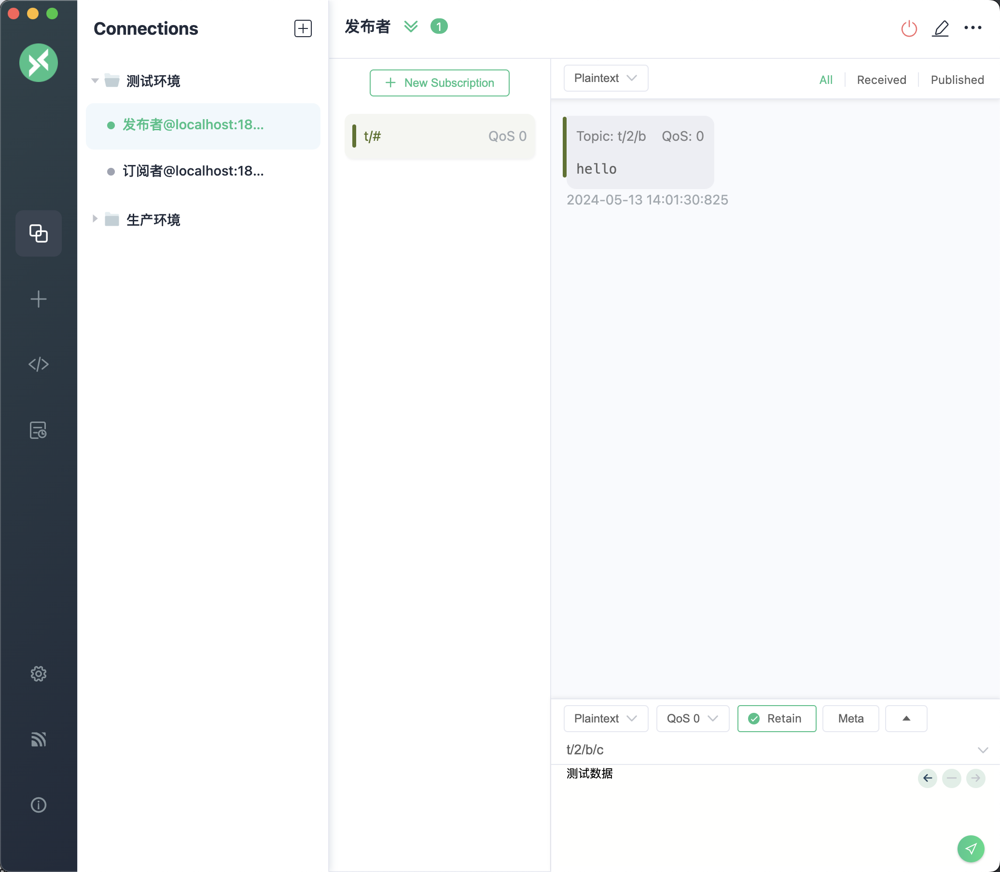
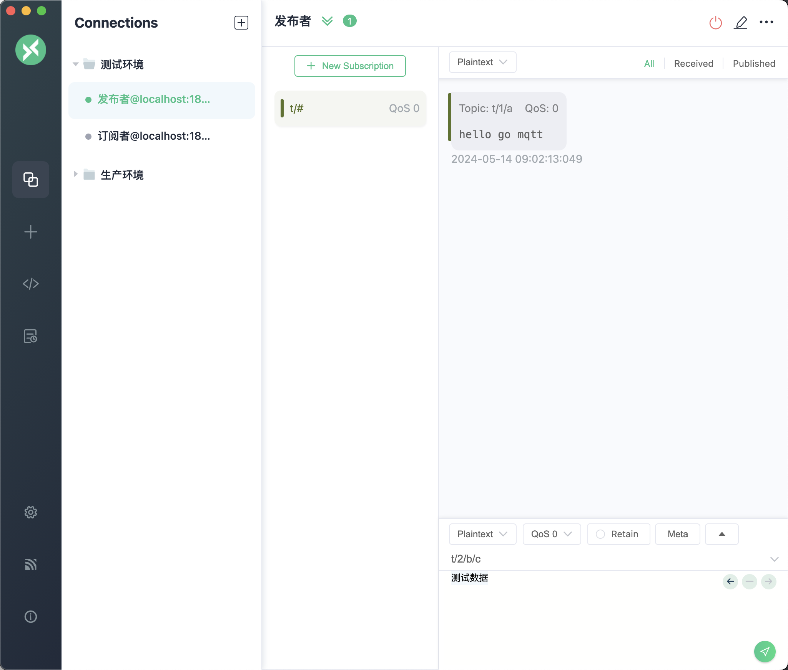
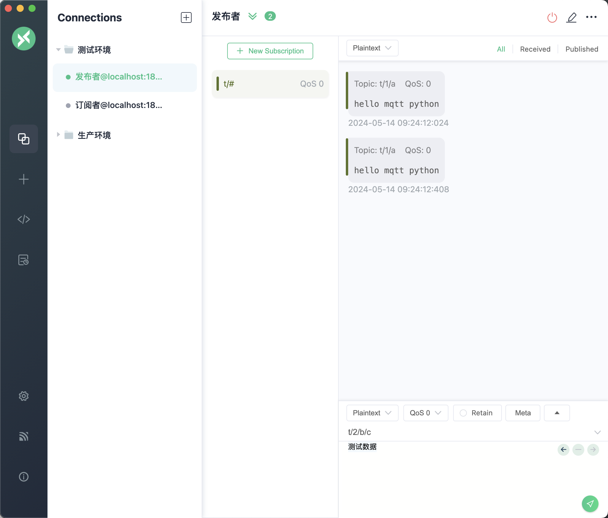

通过本章你将学到：

1. Java 与 MQTT 服务交互
2. Golang 与 MQTT 服务交互
3. Python 与 MQTT 服务交互

## Java 与 MQTT

在Java项目中，通过使用Maven作为依赖管理工具，可以很容易地集成MQTT客户端。以下是如何在pom文件中添加MQTT客户端依赖以及创建一个基本的MQTT客户端程序的步骤。

### 添加Maven依赖

要在pom.xml文件中添加Eclipse Paho MQTT客户端的依赖，请加入以下代码：

```
<dependency>
    <groupId>org.eclipse.paho</groupId>
    <artifactId>org.eclipse.paho.client.mqttv3</artifactId>
    <version>1.2.5</version>
</dependency>
```

这将确保你的项目中包含了Eclipse Paho MQTT客户端库。以下是创建一个基本MQTT客户端的Java程序示例：

```Java
import org.eclipse.paho.client.mqttv3.MqttClient;
import org.eclipse.paho.client.mqttv3.MqttConnectOptions;
import org.eclipse.paho.client.mqttv3.MqttException;
import org.eclipse.paho.client.mqttv3.MqttMessage;

import java.nio.charset.StandardCharsets;

public class MqttTest {
    public static void main(String[] args) throws MqttException {
        String broker = "tcp://127.0.0.1:1883";
        String clientId = "demo_client";
        MqttClient client = new MqttClient(broker, clientId);
        MqttConnectOptions options = new MqttConnectOptions();
        options.setUserName("admin");
        options.setPassword("admin123".toCharArray());
        client.connect(options);
    }
}
```

通过上述程序会获得一个MQTT客户端，下面使用这个MQTT客户端进行消息发送和消息接收的演练。

关于消息发送需要使用到MqttMessage对象，设置这个对象中的payload属性即可完成发送消息的组装，具体程序代码如下。

```Java
MqttMessage message = new MqttMessage();
message.setPayload("hello".getBytes(StandardCharsets.UTF_8));
client.publish("t/2/b", message);
```

执行后效果如图所示



下面我们将演示消息的接收，需要为MQTT客户端设置CallBack接口的实现类，具体处理代码如下。

```Java
client.setCallback(new MqttCallback() {
    public void messageArrived(String topic, MqttMessage message) throws Exception {
        System.out.println("topic: " + topic);
        System.out.println("qos: " + message.getQos());
        System.out.println("message content: " + new String(message.getPayload()));
    }

    public void connectionLost(Throwable cause) {
        System.out.println("connectionLost: " + cause.getMessage());
    }

    public void deliveryComplete(IMqttDeliveryToken token) {
        System.out.println("deliveryComplete: " + token.isComplete());
    }
});

client.subscribe("t/#");
```

在上述程序中主要关注messageArrived函数，它能够用于接收MQTT客户端发出数据。另外请千万不要忘记编写client.subscribe("t/#")。如果没有这句代码将不会进行订阅。接下来启动程序后，通过MQTTX发送消息，此时控制台输出内容如下。

```Java
topic: t/2/b/c
qos: 0
message content: 测试数据
```

## Golang 与 MQTT

在Go语言项目中集成MQTT通信功能，可以通过eclipse/paho.mqtt.golang包来实现。以下是安装该包、创建基本的MQTT客户端以及发送和接收消息的步骤。使用下面的Go命令安装MQTT交互包：

```
go get github.com/eclipse/paho.mqtt.golang
```

以下是Go语言中创建基本MQTT客户端的示例代码：

```Go
package main

import (
    "fmt"
    mqtt "github.com/eclipse/paho.mqtt.golang"
)

var messagePubHandler mqtt.MessageHandler = func(client mqtt.Client, msg mqtt.Message) {
    fmt.Printf("Received message: %s from topic: %s\n", msg.Payload(), msg.Topic())
}

var connectHandler mqtt.OnConnectHandler = func(client mqtt.Client) {
    fmt.Println("Connected")
}

var connectLostHandler mqtt.ConnectionLostHandler = func(client mqtt.Client, err error) {
    fmt.Printf("Connect lost: %v", err)
}

func main() {
    var broker = "localhost"
    var port = 1883
    opts := mqtt.NewClientOptions()
    opts.AddBroker(fmt.Sprintf("tcp://%s:%d", broker, port))
    opts.SetClientID("go_mqtt_client")
    opts.SetUsername("admin")
    opts.SetPassword("admin123")
    opts.SetDefaultPublishHandler(messagePubHandler)
    opts.OnConnect = connectHandler
    opts.OnConnectionLost = connectLostHandler
    client := mqtt.NewClient(opts)
    if token := client.Connect(); token.Wait() && token.Error() != nil {
        panic(token.Error())
  }
}
```

在这段程序中主要关注的程序如下：

1. opts := mqtt.NewClientOptions()用来创建链接参数设置账号密码之类的数据
2. opts.OnConnect可以设置链接建立时要执行的逻辑
3. opts.OnConnectionLost可以设置链接丢失时的处理逻辑
4. opts.SetDefaultPublishHandler(messagePubHandler)用来处理消息接收到后的处理逻辑。

下面编写消息发送函数，具体处理代码如下。

```Go
func publish(client mqtt.Client) {
    client.Publish("t/1/a", 0, false, "hello go mqtt")
}
```

执行上述发送函数后MQTTX收到的数据效果如图所示。



接下来编写订阅主题相关的程序，具体代码如下。

```Go
func sub(client mqtt.Client) {
    topic := "t/#"
    client.Subscribe(topic, 1, nil)
}
```

使用MQTTX向主题t/2/b/c发送测试数据，此时Go程序收到数据如下。

```Go
Received message: 测试数据 from topic: t/2/b/c
```

## Python 与 MQTT

在 Python 中使用 MQTT（消息队列遥测传输协议）进行消息传递是非常高效的。下面是详细的步骤和解释，如何使用 paho-mqtt 库创建一个基本的
MQTT 客户端，包括发布和订阅消息的完整示例。

通过 pip 安装 paho-mqtt 库：

```Go
pip3 install -i https://pypi.doubanio.com/simple paho-mqtt
```

以下代码展示了如何创建一个 MQTT 客户端并连接到 MQTT Broker：

```Go
from paho.mqtt import client as mqtt_client


broker = 'localhost'
port = 1883
client_id = 'python-mqtt-client'


def connect_mqtt():
    def on_connect(client, userdata, flags, rc):
        if rc == 0:
            print("Connected to MQTT Broker!")
        else:
            print("Failed to connect, return code %d\n", rc)

    client = mqtt_client.Client(mqtt_client.CallbackAPIVersion.VERSION1,client_id)

    client.username_pw_set("admin", password="admin123")
    client.on_connect = on_connect
    client.connect(broker, port)
    return client
```

接下来编写模拟的消息推送，具体程序代码如下。

```Go
def publish(client):
    msg = "hello mqtt python"
    topic= "t/1/a"
    result = client.publish(topic, msg)
    status = result[0]
    if status == 0:
        print(f"Send `{msg}` to topic `{topic}`")
    else:
        print(f"Failed to send message to topic {topic}")


def run():
    client = connect_mqtt()
    client.loop_start()
    publish(client)
```

执行上述程序中的run方法，最终在MQTTX中效果如图所示。



接下来编写订阅主题相关的程序，具体代码如下。

```Go
def subscribe(client: mqtt_client):
    def on_message(client, userdata, msg):
        print(f"Received `{msg.payload.decode()}` from `{msg.topic}` topic")

    client.subscribe("t/#")
    client.on_message = on_message

def run2():
    client = connect_mqtt()
    subscribe(client)
    client.loop_forever()
```

执行上述程序中的run2方法，使用MQTTX向主题t/2/b/c发送测试数据，此时Python程序收到数据如下。

```Go
Received `测试数据` from `t/2/b/c` topic
```
