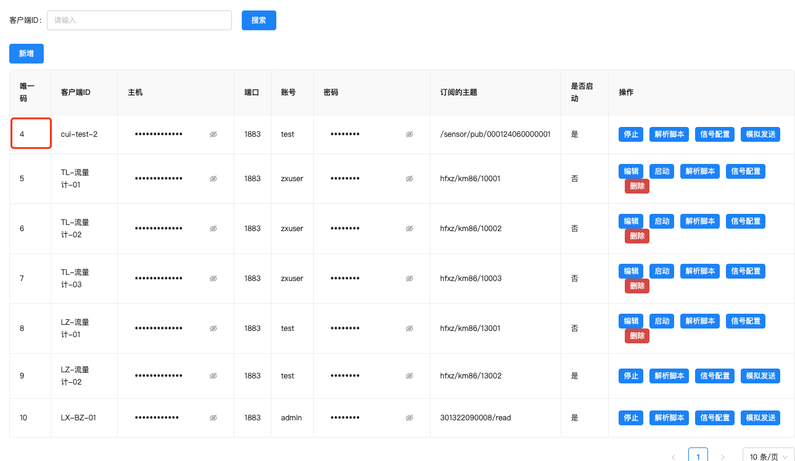
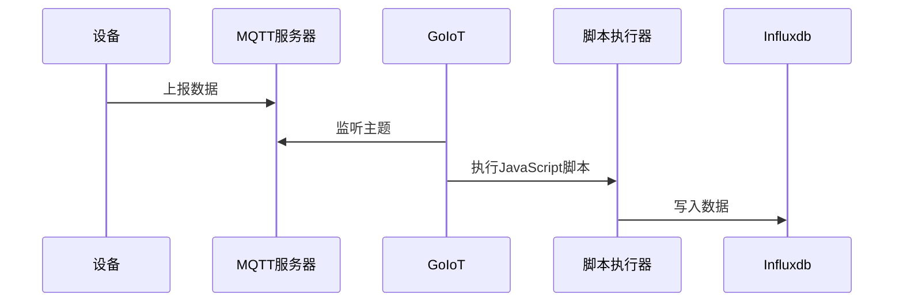

在 Go IoT 开发平台中允许用户编写针对不同MQTT客户端的解析脚本，这个解析脚本需要能够正常执行。 案例程序如下

```javascript
function main(nc) {
    var dataRows = [
        { "Name": "Temperature", "Value": "23" },
        { "Name": "Humidity", "Value": "30" },
        { "Name": "A", "Value": nc },
    ];
    var result = {
        "Time":  Math.floor(Date.now() / 1000),
        "DataRows": dataRows,
        "DeviceUid": "5",
        "IdentificationCode":"5",
        "Nc": nc
    };
    return [result];
}
```

在上述程序中通过MQTT客户端上报的数据会使用字符串的方式传输到 `main` 函数中(nc是参数名称) 这个内容请不要调整。

关于返回值，必须包含 Time、DataRows、DeviceUid、IdentificationCode 数据字段 他们的含义分别如下：

1. Time: 设备数据生产时间，秒级时间戳。
1. DataRows: 核心信号数据点位。是数组结构其中键为Name和Value，Name表示信号名称，Value表示信号数据值。
1. DeviceUid: MQTT客户端ID，请和当前行数据的唯一码对应。**请一定要检查仔细**




4.   IdentificationCode: 设备标识码，如果你的订阅主题没有通配符，这个数据信息请和DeviceUid保持一致。若出现通配符请和DeviceUid做好差异化区分。


>   注意事项：
>
>   1.   DeviceUid这个是在返回值中写死的。不要做动态生成。
>   2.   IdentificationCode原则上需要强制和DeviceUid做差异化，即两个不能相同。


## 数据链路




在写入Influxdb的时候按照如下数据组装规则进行组装。

1.   bucket：项目固定配置。

2.   Measurement：动态计算而得 `${协议}_${DeviceUid}_${IdentificationCode}`


```go
func genMeasurement(dt DataRowList, protocol string) string {
	return protocol + "_" + dt.DeviceUid + "_" + dt.IdentificationCode
}
```

