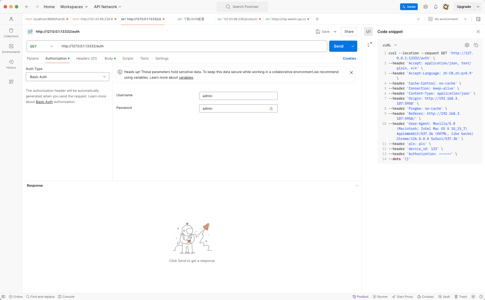
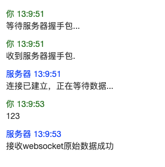

## 接入流程


1.   通过HTTP Base Auth 进行登录认证。注意：这个账号密码信息需要通过前端程序进行设置。

以Postman软件为例可以发送如下请求



>   在这个请求发送过程中需要重点注意：
>
>   1.   认证方式为Basic Auth 
>   2.   在请求头中携带device_id


当发送完成请求后会得到类似如下结构的数据

```json
{
    "message": "认证通过",
    "uid": "123@5c1004d6-52e8-11ef-bba5-acde48001122"
}
```

这个uid是用来创建WebSocket客户端的依据


2.   创建WebSocket客户端，链接组装格式为`ws://127.0.0.1:13332/ws?id=${uid}`

>   注意一旦主动断开这个链接，这个uid将永久失效。失效后请重新完成HTTP Base Auth 认证。


一旦链接建立成功客户端即可开始进行消息上传，消息上传后正常情况下会收到`接收websocket原始数据成功`文本。




## 数据流

