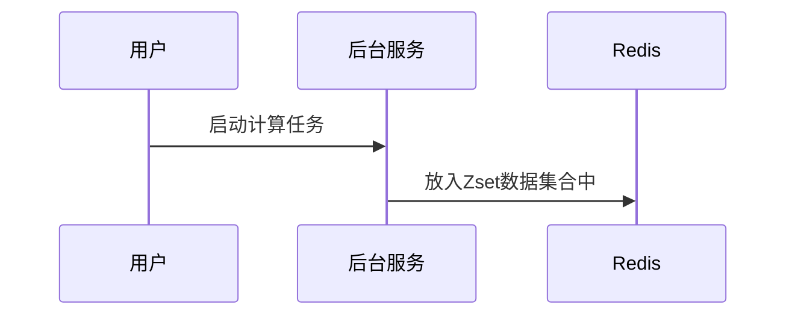
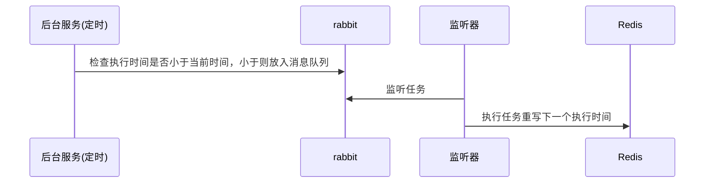

在物联网项目中数据的使用是一个很重要的环节。在Go IoT 开发平台中使用JavaScript的方式对计算规则进行编写。

核心概念：

1. 执行周期: 采用cron表达式描述任务的执行时间。
2. 前移时间: 从执行时间往前推移N秒。
3. 脚本: 使用JavaScript编写的计算程序。
4. 脚本参数: 用于构成脚本计算的参数主要内容如下。
   - 参数名称：传入脚本时候的参数名。
   - MQTT客户端ID：MQTT客户端ID。
   - 信号：MQTT客户端ID下存在的信号。
   - 聚合方式：平均值、求和、最大值、最小值、原始、首条、尾条。

数据计算逻辑：

1.   通过执行时间+前移时间可以得到数据的时间查询范围：开始时间和结束时间。
2.   通过MQTT客户端和信号可以在Influxdb中找到数据内容。
3.   通过聚合方式配合influxdb得到查询结果。
4.   上述内容放入脚本执行得到最终处理结果。

## 数据链路

-   启动流程

-   任务分配流程

