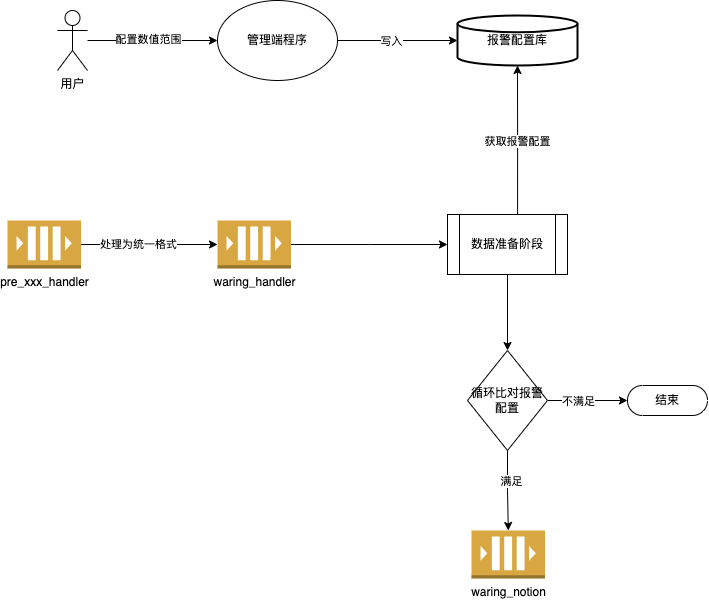
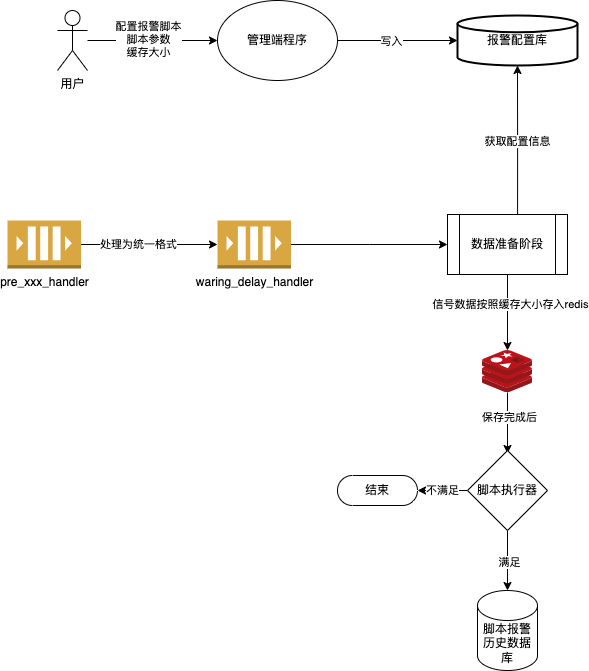

# 数据报警设计

## 场景概括

数据报警在物联网项目中是一个十分重要的应用场景。在实际业务开发过程中我们可能遇到的报警形式存在如下可能：

1. 判断当前信号是否在一个特定的范围内，可以是在范围内报警或者是不在范围内报警。

> **案例**:
>
> **温度监控报警**：在工业环境中，设备可能需要在特定的温度范围内运行以保证效率和安全。如果设备的温度超过了这个范围，系统会触发一个高温报警，提醒操作人员检查设备或采取冷却措施。
>
> -   **在范围内报警**：设备温度在40°C到60°C之间是正常的，如果设备温度持续在这一范围内，系统可能不会发出报警。
> -   **不在范围内报警**：如果设备温度超过60°C，系统会发出高温报警；如果低于40°C，可能会发出低温报警。

2. 趋势性比较，当前数据与前一个数据进行比较，是否在特定范围内（百分比范围）。在这个模式下也可能是多个历史数据比较而非只是前一个。

>   **案例**:
>
>   **设备性能下降报警**：在生产过程中，设备的性能可能会随时间逐渐下降。通过比较当前的性能指标与前一个周期的性能指标，可以设置一个性能下降的阈值。
>
>   -   如果设备的性能指标（如产量、速度等）在连续几个周期内下降超过设定的百分比（例如5%），则系统会发出性能下降报警。

3. 多设备联动报警，在这种模式下参与报警计算的会存在多个设备，这些设备会在现实场景中存在一定的关联性。当其中一个指标满足报警条件时，会继续观测其他设备指标，前者是后者的参考，如果满足条件则报警。

>   **案例:**
>
>   **环境监测设备联动报警**：在环境监测中，不同的监测设备可能监测同一环境的不同参数。
>
>   -   例如，如果某个区域的空气质量监测站检测到污染物浓度突然上升，系统会检查该区域的气象站数据，看是否有不利于污染物扩散的气象条件。如果气象条件确实不利于扩散，系统会发出联动报警，提示可能存在严重的空气质量问题。

## 工程设计

面对前文提到的场景我们对整个报警系统进行了抽象设计。分为两大类报警模式：
1. 数值报警
2. 脚本报警

### 数值报警

数值报警是数据报警的典型场景，用户仅需要创建信号、阈值区间、报警规则（区间内报警、区间外报警）。

程序侧实现逻辑： 设备数据被解析后在信号配置表中找到对应的数据进行数值比较，如果满足阈值条件则触发报警。

### 脚本报警

脚本报警是数据报警的另一种场景，用户需要创建信号、缓存大小（存储多少条信号历史数据）、报警脚本、脚本参数。

程序执行链路如下：
1. 设备数据在上报完成后进行数据缓存，此时缓存的数据是具备容量限制的（容量限制：缓存大小），这里缓存的数据会被后续的报警脚本使用。
2. 在完成缓存数据的存储后会执行报警脚本的执行，报警脚本是一个用JavaScript编写的程序，返回boolean数据。

