# 操作文档

## 前提

进入项目的时候需要出现弹窗校验，只有输入some后才能进去项目。

## MQTT客户端管理

### 新增

操作如下：单击mqtt客户端管理菜单，后单击界面中新增按钮

新增弹窗如下

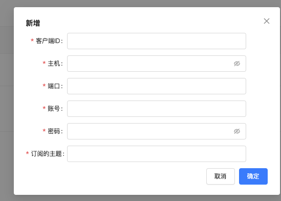

输入信息后点击确定按钮，所有信息必填，有遗漏信息会提示，如输入信息不符合也会提示校验结果

输入完正确的信息之后，在单击确定按钮，在列表上出现新的的信息

### 编辑

操作如下：在列表操作栏点击编辑按钮

编辑修改的内容，然后点击保存修改内容，列表中内容被修改。

### 删除

操作如下：单击列表中的删除按钮，出现二次弹窗，点击确定后，该条数据被删除

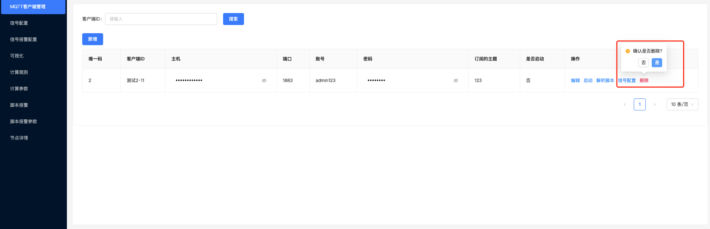

### 查询

操作如下：在MQTT客户端管理页面中，在客户端ID输入框中输入要查询的信息，然后单击搜索按钮，列表显示出要查询的信息。

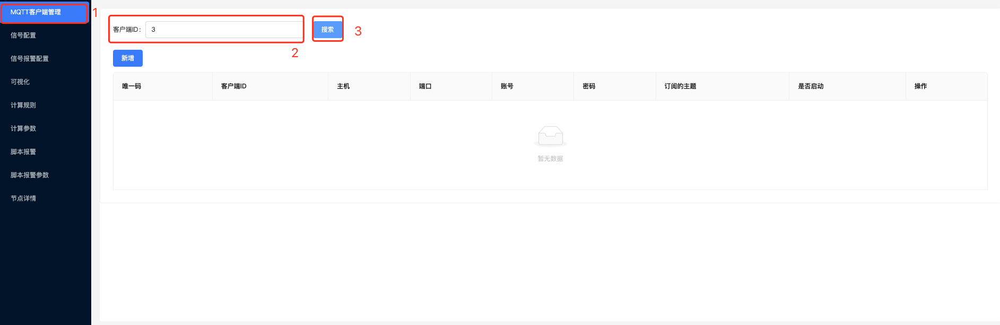

### 解析脚本

操作如下：单击解析脚本按钮，出现解析脚本弹窗

​       将鼠标移到示例脚本上的时候，会在右侧出现示例脚本，单击示例脚本，会复制下来，然后粘贴到

下面代码框中。

​				

​        可以在脚本中设置自己想要的值，并且可以设置传递参数到脚本中，输入脚本还有传递参数后，验证按钮变成可点击的状态，点击验证，返回解析结果并展示出来。

​    确定解析结果无误后，点击确定按钮，传递解析脚本

### 启动

操作如下：单击该条数据中操作栏中的启动按钮，该条数据被启动，启动状态下，数据无法被编辑

	

### 模拟发送

操作如下：数据在启动状态的时候，会出现模拟发送按钮，单击模拟发送按钮，出现发送消息的弹窗，发送消息的时候，所有消息必填，输入完所有信息后，单击确定按钮，发送消息。

### 停止

操作如下：在启动状态下的数据，在操作栏中单击停止按钮，出现二次确定弹窗，单击确认后数据，数据停止启动，恢复可编辑的状态。

### 信号配置

操作如下：单击操作栏中的信号配置按钮，跳转到信号配置页面，在信号配置页面中，客户端ID，默认就是该条数据的客户端ID

## 信号配置

### 新增

操作如下：可以根据MQTT客户端管理页面中，数据列表操作栏中的信号配置进入到该页面，可以单击左侧菜单栏中的信号配置进去，之后单击新增按钮出现新增信号配置弹窗。

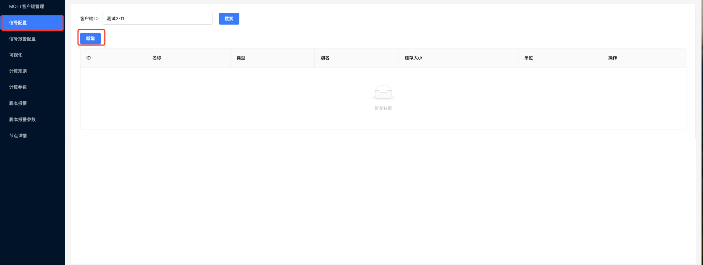

输入信息后点击确定按钮，所有信息必填，有遗漏信息会提示，如输入信息不符合也会提示校验结果

新增的信号名称要满足选中客户端ID数据中解析脚本中的名称，单击确认按钮，新增信号。

### 查询

操作如下：选择客户端ID，单击搜索后，搜索该客户端ID下面配置的信号。

### 编辑

操作如下：在列表操作栏点击编辑按钮

编辑修改的内容，然后点击保存修改内容，列表中内容被修改。

### 删除

操作如下：单击列表数据中操作栏中的删除按钮，出现二次确认弹窗，然后点击确认删除数据

### 查看

操作如下：单击列表数据中操作栏的查看按钮，出现数据弹窗，如无数据显示暂无数据，如有数据则展示近三十天数据。

### 信号报警配置

操作如下：单击列表数据中操作栏中的信号报警配置，跳转到信号报警配置页面

跳转进来，默认选中的当条数据的信号名称。

## 信号报警配置

### 新增

操作如下：可以根据信号配置页面中，数据列表操作栏中的信号报警配置进入到该页面，可以单击左侧菜单栏中的信号报警配置进去，之后单击新增按钮出现新增信号配置弹窗。

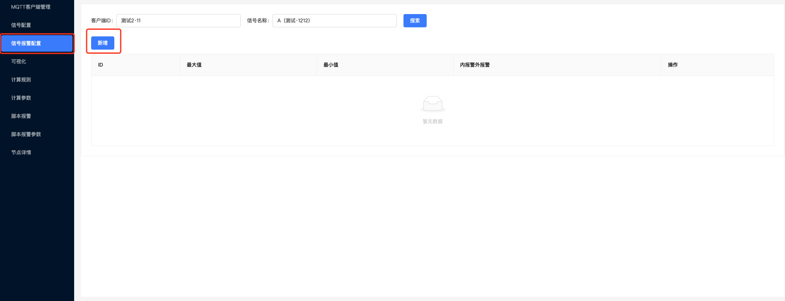

如果需要配置其它客户端ID的信号，则通过页面上选择不同的客户端ID和信号名称来选择新增。

### 查询

操作如下：在信号报警配置页面中，通过筛选不用的客户端ID和信号名称，展示该客户端和信号名称下不同的数据

### 编辑

操作如下：单击列表操作栏中的编辑按钮，

编辑修改的内容，然后点击保存修改内容，列表中内容被修改。

### 报警历史

操作如下：单击列表数据中操作栏的报警历史按钮，出现时间范围选择弹窗，选择时间，单击确定按钮

单击完确定按钮后，出现报警历史表格弹窗

### 删除

操作如下：单击列表数据中操作栏中的删除按钮，出现二次确认弹窗，然后点击确认删除数据

## 可视化

### 新增

操作如下：单击左侧菜单栏中的可视化菜单，进入到可视化页面，然后单击新增按钮

进入到新增页面，单击配置按钮配置数据

输入配置数据，然后单击确定按钮，出现数据展示。

数据展示方式修改，单击折线图柱状图的下拉框，改变数据展示方式

复制单条数据，单击复制按钮，会复制一条一摸一样的数据

拖拽改变数据的顺序，点击数据头部，然后往上下拖拽，改变列表排序。

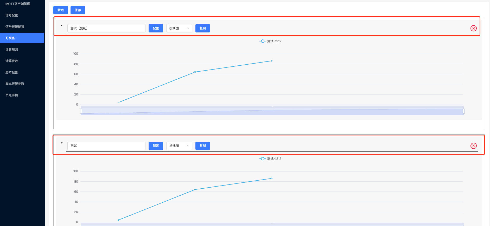

新增数据 单击页面上的新增按钮，会再次出现一条新数据

删除数据 单击数据右上角的删除图片，出现二次确认弹窗，点击确定后删除

保存可视化数据，单击上方保存的按钮，出现弹窗

给要保存的数据添加名称，然后点击确定，新增数据

### 查看/编辑

操作如下：单击列表数据操作栏中的查看按钮，进入到页面，可进行查看和编辑

### 删除

操作如下：单击列表数据中操作栏中的删除按钮，出现二次确认弹窗，然后点击确认删除数据

## 计划规则

### 新增

操作如下：单击左侧的菜单栏中的计算规则进入到计算规则页面，然后单击新增按钮

输入信息后点击确定按钮，所有信息必填，有遗漏信息会提示，如输入信息不符合也会提示校验结果

输入脚本的时候，鼠标移在示列脚本上，出现脚本信息，单击后复制，随后可以粘贴在代码框中

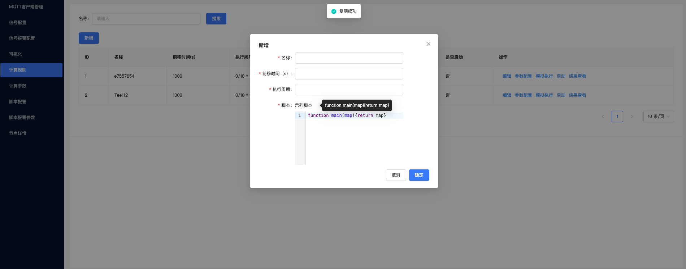

输入完信息后点击确定按钮，新增数据

### 编辑

操作如下：在列表操作栏点击编辑按钮

出现编辑弹窗，修改内容后，单击确定按钮，修改内容

### 查询

操作如下：在名称输入框中输入需要查询的内容，然后点击搜索按钮，列表展示相关的数据

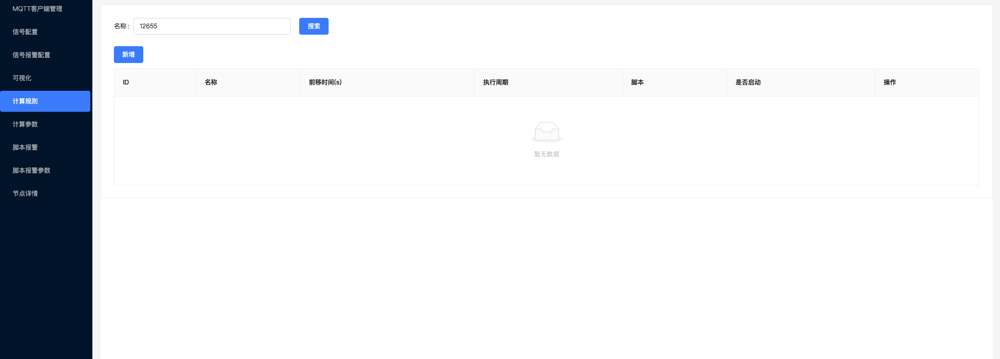

### 模拟执行

操作如下：单击数据列表中操作栏中的模拟执行，出现时间范围弹窗选择

选择完时间后单击确定按钮，返回mock数据并展示

### 启动

操作如下：单击列表数据操作栏中的启动按钮，首先出现弹窗展示之前的模拟执行结果，确认无误后，再单击确定按钮

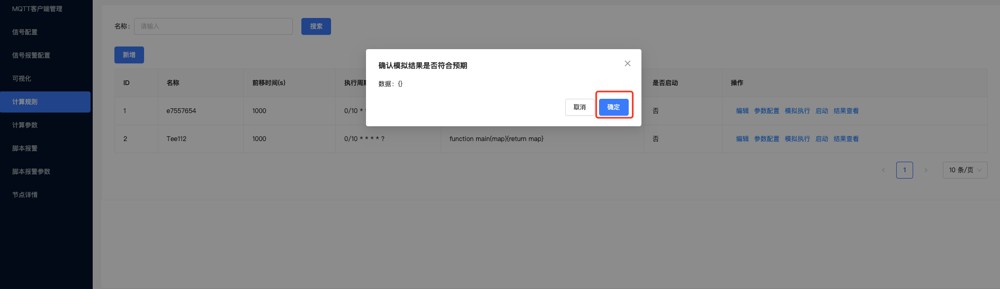

### 结果查看

操作如下：单击列表数据操作栏中的结果查看，出现时间范围弹窗选择

单击确定按钮后，出现列表弹窗，展示数据

单击查看，展示结果

### 停止

操作如下：在启动状态下的数据，在操作栏中单击停止按钮，出现二次确定弹窗，单击确认后数据，数据停止启动，恢复可编辑的状态。

### 参数配置

操作如下：单击列表数据操作栏中的参数配置按钮，跳转到计算参数页面

## 计算参数

### 新增

操作如下：可以根据计算规则中，数据列表操作栏中的参数配置进入到该页面，也可以单击左侧菜单栏中的计算参数进去，之后单击新增按钮出现新增信号配置弹窗。

单击新增按钮出现弹窗

输入信息后点击确定按钮，所有信息必填，有遗漏信息会提示，如输入信息不符合也会提示校验结果

输入完信息后，单击确定按钮，新增数据

### 编辑

操作如下：在列表操作栏点击编辑按钮

编辑修改的内容，然后点击保存修改内容，列表中内容被修改。

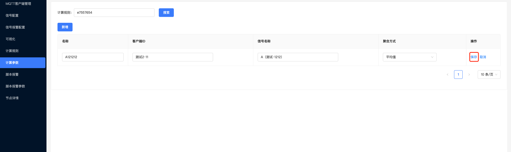

### 查询

操作如下：在页面上方选择不同的计算规则，展示该计算规则下的参数

### 删除

操作如下：单击列表中的删除按钮，出现二次弹窗，点击确定后，该条数据被删除

## 脚本报警

### 新增

操作如下：单击左侧菜单栏中的脚本报警，进入到脚本报警页面中，单击新增按钮，出现新增弹窗

输入信息后点击确定按钮，所有信息必填，有遗漏信息会提示，如输入信息不符合也会提示校验结果

输入脚本的时候，鼠标移在示列脚本上，出现脚本信息，单击后复制，随后可以粘贴在代码框中

输入完信息后点击确定按钮，生产新的脚本信息

### 编辑

操作如下：单击数据列表中操作栏的编辑按钮

出现编辑信息弹窗

修改信息完之后，单击确定按钮，修改信息

### 查询

操作如下：在名称输入框中输入需要查询的信息，单击搜索按钮，列表展示出搜索的有关信息

### 报警历史

操作如下：单击数据列表中的报警历史按钮，出现时间范围选择框

选择完时间范围后，单击确定按钮，出现报警历史信息，有表格跟折线图两种方式展示

### 调试脚本

操作如下：单击数据列表中操作栏的调试脚本按钮，出现模拟参数弹窗

确认参数无误后，单击执行按钮，显示出执行结果。

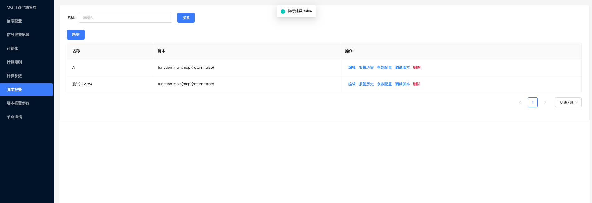

### 删除

操作如下：单击数据列表中的删除按钮，出现二次确认弹窗，单击确认后，删除该条数据

### 参数配置

操作如下：单击数据列表中操作栏中的参数配置按钮，跳转到该条数据下的脚本报警参数页面

## 脚本报警参数

### 新增

操作如下：单击左侧菜单栏中的脚本报警参数，也可以通过脚本报警中的参数配置按钮，进入到脚本报警参数页面后，单击新增按钮，出现新增弹窗。

输入信息后点击确定按钮，所有信息必填，有遗漏信息会提示，如输入信息不符合也会提示校验结果

输入完正确的信息后，点击确定按钮，新增数据

### 编辑

操作如下：单击数据列表中操作栏中的编辑按钮

修改数据的信息后，再单击保存按钮，修改数据

### 查询

操作如下：根据页面选择不同的脚本报警，列表展示该脚本报警下的参数数据

### 删除

操作如下：单击列表数据中操作栏中的删除按钮，出现二次确认弹窗，点击确定，删除该条数据

## 节点详情

### 展示

单击左侧菜单栏中的节点详情，进入到页面

### 详情展示

操作如下：单击图标信息，出现详情弹窗，展示该节点信息，以及客户端信息

