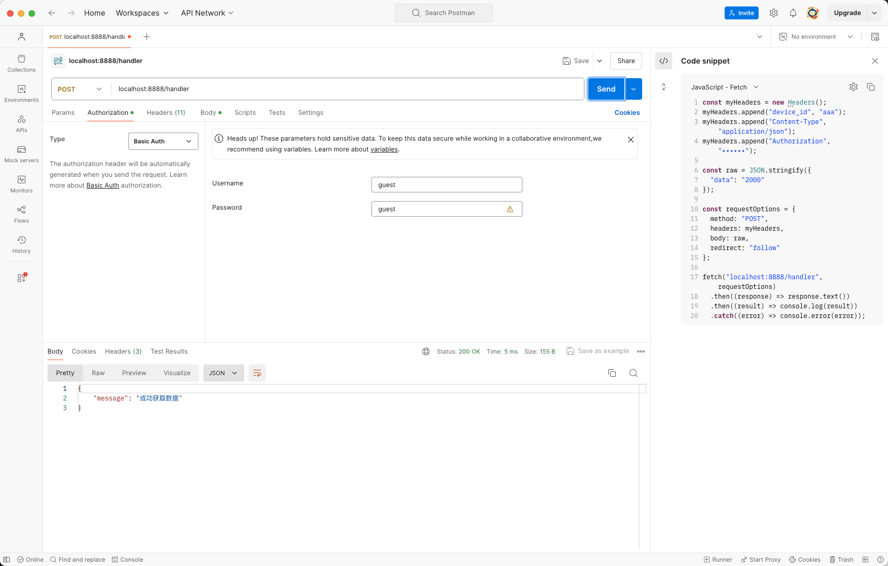

# 扩展协议支持


## TCP 

- nginx 配置

```
stream{

    upstream tcpserver {
        server 0.0.0.0:3333; # 实例端口
        server 0.0.0.0:3332;
    }
    server {
        listen 22122;
        proxy_pass tcpserver;
    }
}
```

识别码建立过程

1.   执行如下指令完成TCP链接建立

```
nc -v 127.0.0.1 22122
```

2.   发送`uid:`开头的数据，用于确认具体的设备唯一编码
3.   发送实际数据进行处理


-   完整TCP请求案例

```
nc -v 127.0.0.1 22122
Connection to 127.0.0.1 port 22122 [tcp/*] succeeded!
1
请发送uid:xxx格式的消息进行设备ID映射。
uid:1
成功识别设备编码.
datadata
数据已处理.
```


## HTTP

1. 账号密码认证模式 basicc auth 



2.   请求头中需要标注设备id。键名为`device_id`

3.   请求体结构为 

```
{
    "data":"字符串"
}
```


## COAP

