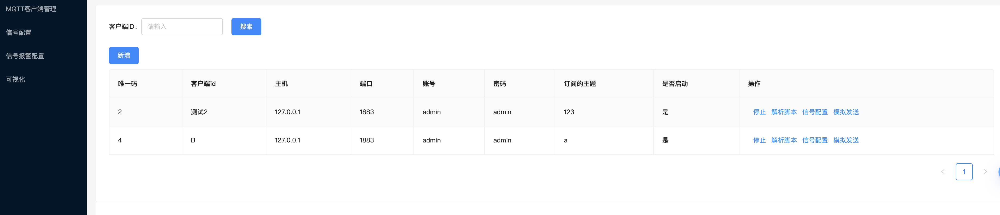
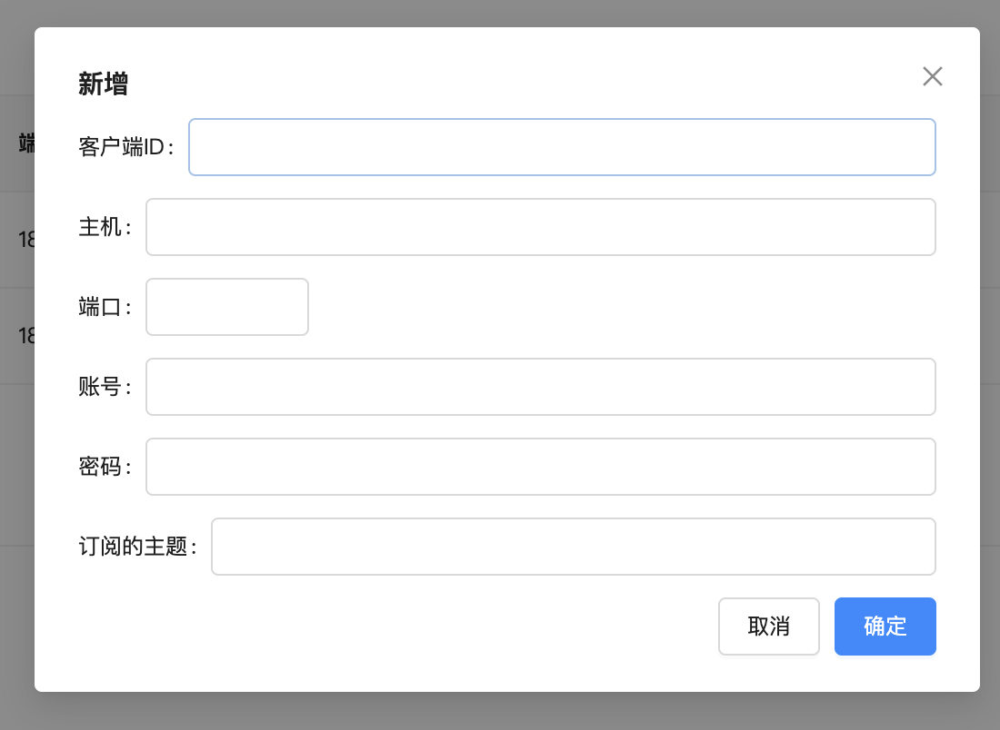
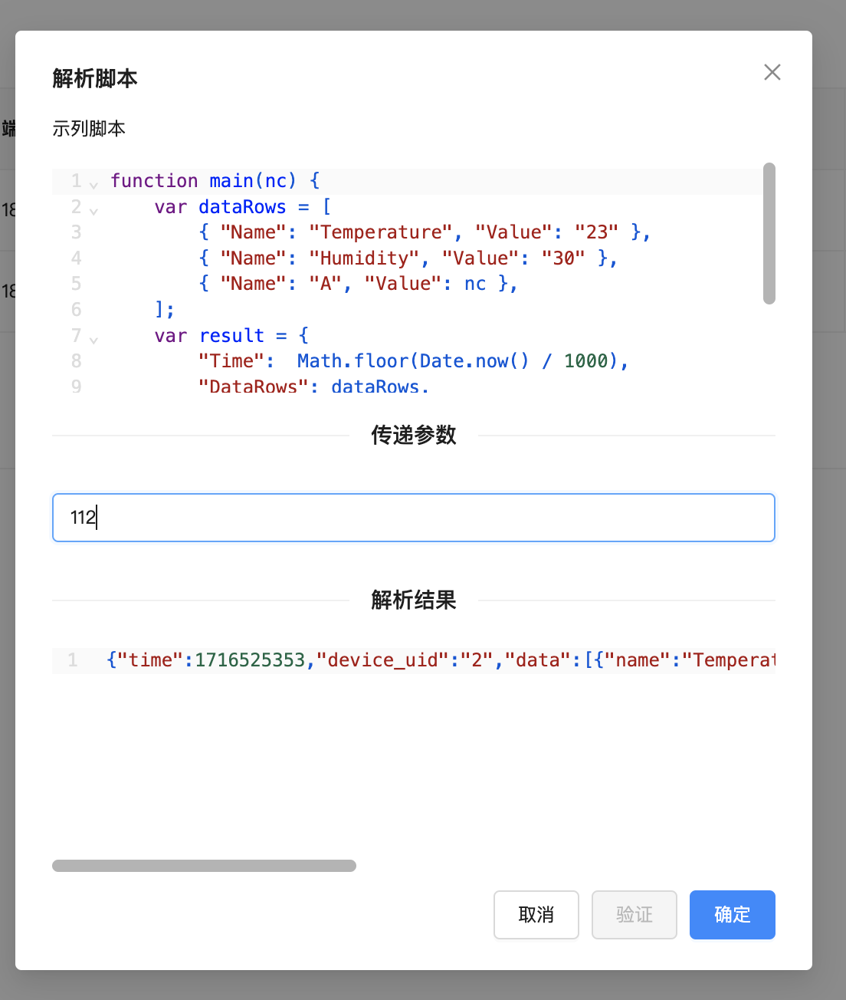
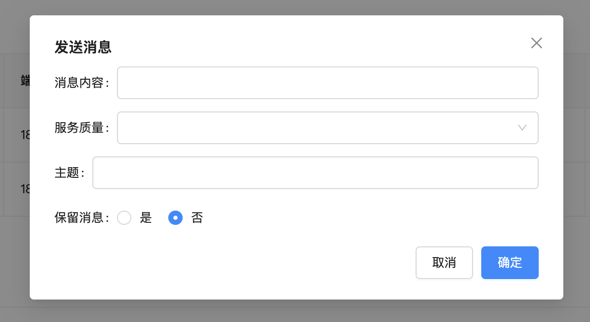
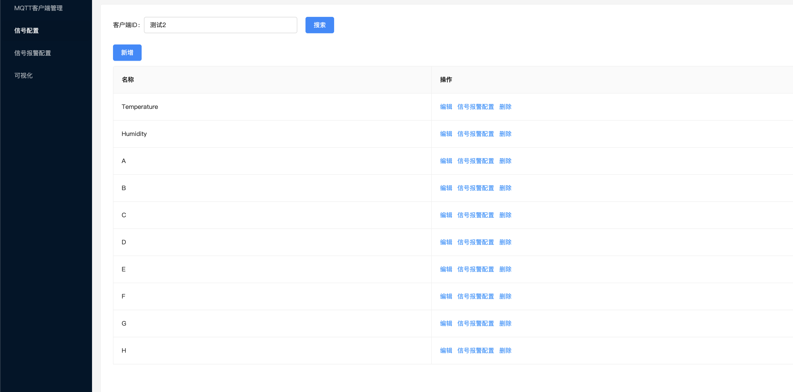
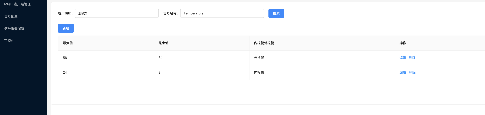
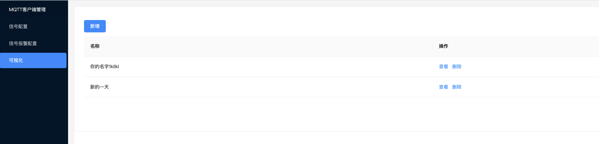
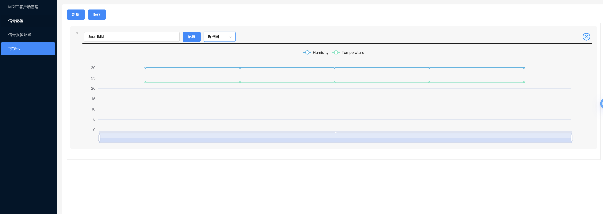
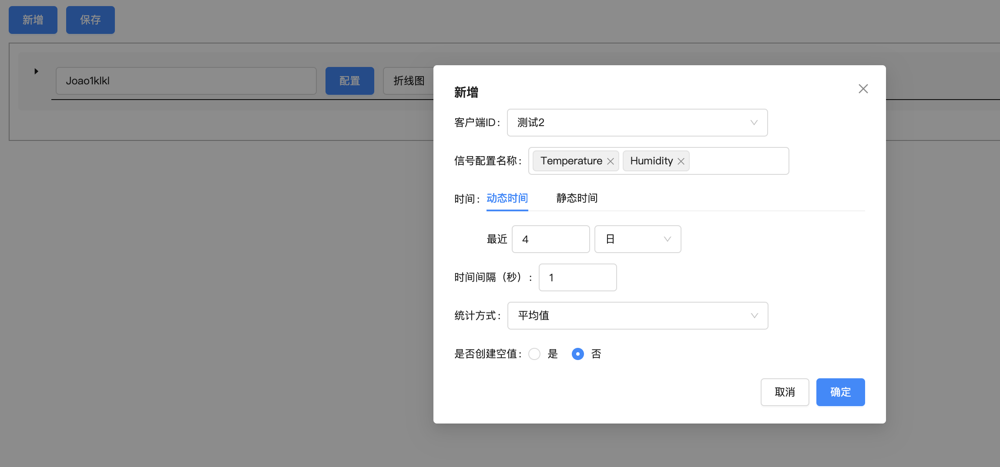

# Go IoT Platform

Go IoT Platform, a high-efficiency and scalable Internet of Things solution developed with the Go language. This platform focuses on providing stable and reliable MQTT client management, as well as comprehensive processing and analysis of MQTT reported data.

## Features

- **MQTT Client Management**: Maintain stable connections for a large number of MQTT clients.
- **Data Storage**: Securely store data reported by MQTT.
- **Alarm Analysis**: Perform real-time monitoring and alarm analysis of reported data.
- **Data Visualization**: Provide intuitive data presentation to help users quickly understand the data.
- **Offline Computing**: Support in-depth offline analysis and processing of historical data.

## Interface Screenshots

| Description        | Screenshot                                                             |
|-----------|----------------------------------------------------------------|
| MQTT Client List |  |
| Add MQTT Client |  |
| Parsing Script      |  |
| Simulate Sending      |  |
| Signal Configuration List    |  |
| Signal Alarm Configuration List  |  |
| Data Visualization     |  |
| Data Visualization     |  |
| Data Visualization     |  |

## Table of Contents
- [go-iot](./go-iot): MQTT Client Management Service
- [go-iot-mq](./go-iot-mq): Rabbit Message Queue Service
- [iot-go-project](./iot-go-project): Management Backend Service
- [ant-vue](./ant-vue): 基于ant-vue开发的后台管理系统

## Documentation

Detailed deployment guides can be found in the [deploy](./deploy) directory.

Related design and implementation documents can be found in the [docs](./docs) directory.

The user manual can be found in the [operation](./operation) directory.

## Contribution

We welcome any form of contribution, including but not limited to:

- Reporting issues
- Submitting Pull Requests
- Improving documentation

## Acknowledgements

Thanks to all contributors and users for their support of the Go IoT Platform!

## Contact Information

If you have any questions, please contact us through the following methods:

- Send an email to [huifer97@163.com](mailto:huifer97@163.com)