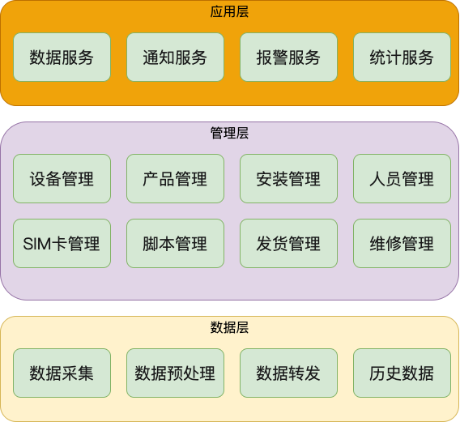
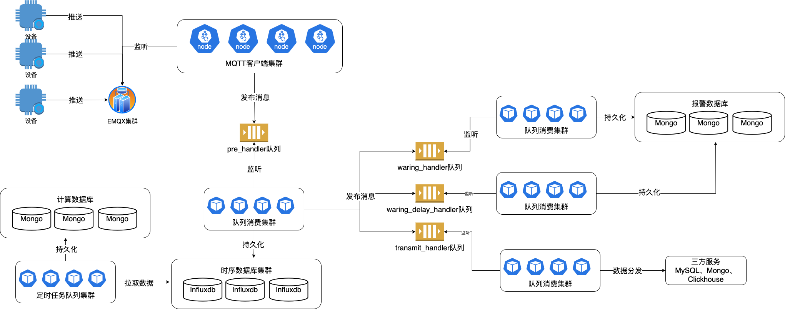
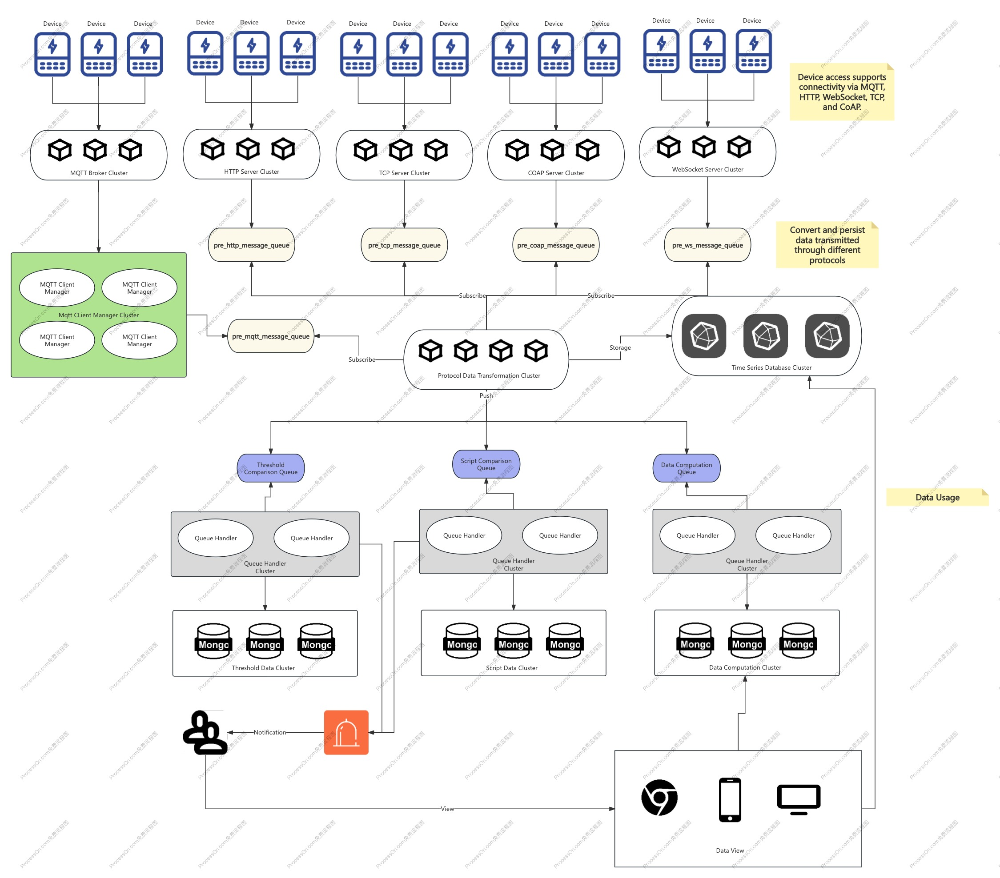

# Go IoT 

Go IoT 是开源分布式物联网（IOT）开发平台，用于快速开发，部署物联设备接入项目，是一套涵盖数据生产、数据使用和数据展示的解决方案。

> :rocket: 非常欢迎广大兴趣爱好者的加入，你的 Star 是我们开发的动力 ！

## 架构设计

- 数据层：负责进行物联数据的采集、预处理、转发和存储，为应用层提供数据服务。
- 管理层：用于提供物联网平台的管理功能，包括设备管理、人员管理、安装管理、产品管理、SIM卡管理（物联网卡管理）、解析脚本管理、发货管理等。
- 应用层：用于提供快速的业务实现，以配置化的方式快速建设基础业务。

## 数据流转

数据从设备上使用MQTT协议将数据推送给MQTT服务集群。 
- MQTT客户端的集群程序在[go-mqtt-manager](./go-iot)中，它是一个基于Redis实现的支持负载均衡、故障转移、高可用的MQTT客户端集群。
- pre_handler队列: 用于对设备上报的数据进行预处理，包括数据过滤、数据转换等（预处理脚本使用JavaScript进行编写）。
- waring_handler队列: 用于对**预处理后**的数据进行告警处理。区别于waring_delay_handler队列，它只能完成单一信号单次的区间判断。
- waring_delay_handler队列: 用于对**预处理后**的数据进行告警处理。区别于waring_handler队列，它能够完成的报警模式更加多样化，但是这需要编写报警判断脚本（使用JavaScript进行实现）。
- transmit_handler队列: 用于将**预处理后**的数据转发到cassandra、clickhouse、influxdb2、mongo、mysql、kafka、rabbit等
- 定时任务队列集群：这是使用Redis+RabbitMQ实现的定时任务，他能够完成用户定义的复杂计算任务（基于JavaScript编写任务）。

## 开源贡献
- 从`dev`分支拉取代码`checkout`一个新的分支(注意: 务必保持`dev`分支的最新状态)
- 分支命名格式: `feat-功能名称` 
- 在新分支上编辑文档, 代码, 并提交
- 提交 PR 合并到 dev 分支, 等待作者合并即可

## 开源协议

Go IoT 遵循 [Apache2](./LICENSE) 开源协议发布。允许商业使用, 但务必保留类作者, Copyright 信息。
## 联系方式

如有任何问题，可以通过以下方式联系我们：

- 发送邮件至 [huifer97@163.com](mailto:huifer97@163.com)

## 模块扩展
- 物联网卡发卡平台
    - 套餐
    - 