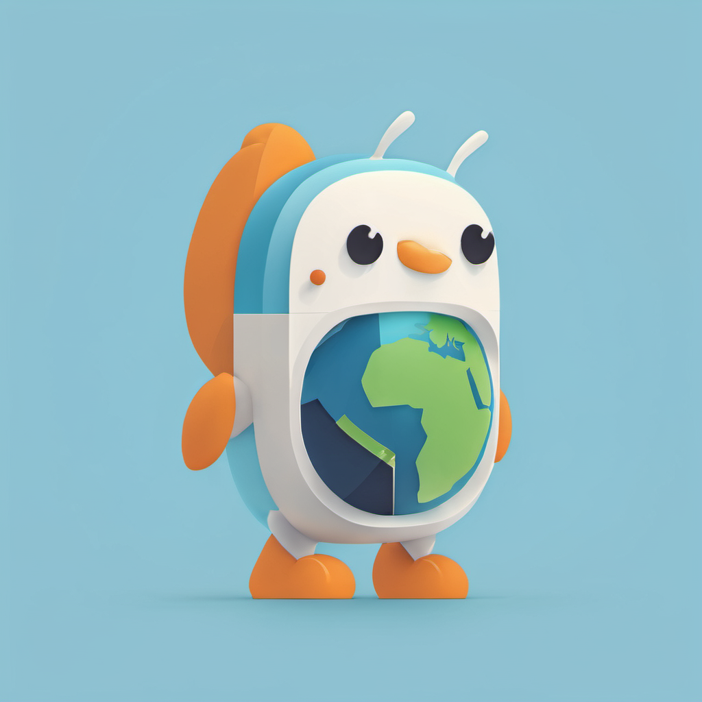
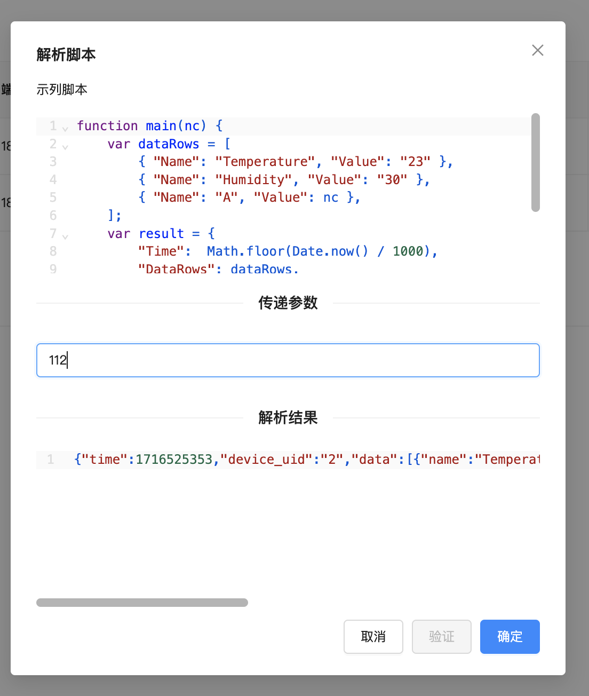
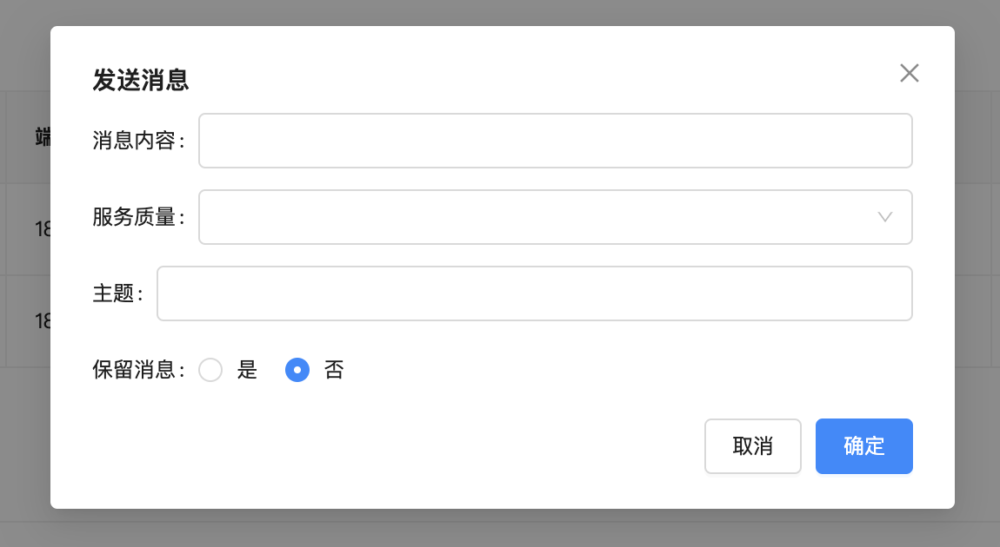
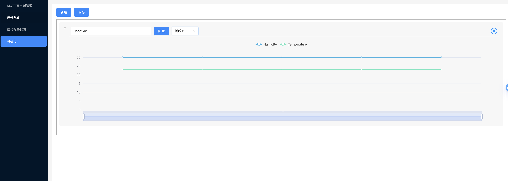
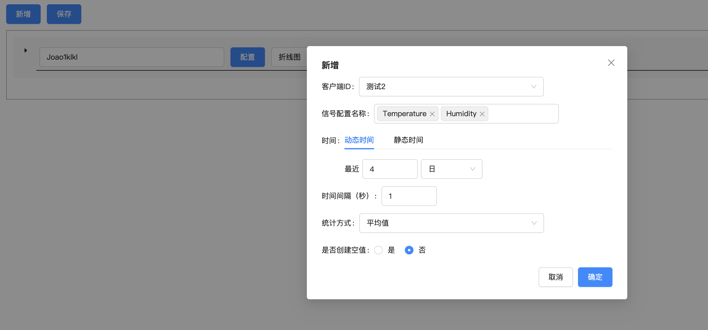

# Go IoT 平台

Go IoT 平台，这是一个高效、可扩展的物联网解决方案，使用 Go 语言开发。本平台专注于提供稳定、可靠的 MQTT 客户端管理，以及对 MQTT上报数据的全面处理和分析。

如果可以请为我投票：

## 特点

- **MQTT 客户端管理**：维持大量 MQTT 客户端的稳定连接。
- **数据存储**：安全存储 MQTT 上报的数据。
- **报警分析**：对上报数据进行实时监控和报警分析。
- **数据可视化**：提供直观的数据展示，帮助用户快速理解数据。
- **离线计算**：支持对历史数据进行深入的离线分析和处理。

## 界面截图

| 说明        | 截图                                                             |
|-----------|----------------------------------------------------------------|
| MQTT客户端列表 |  |
| 新增MQTT客户端 |  |
| 解析脚本      |  |
| 模拟发送      |  |
| 信号配置列表    |  |
| 信号报警配置列表  |  |
| 数据可视化     |  |
| 数据可视化     |  |
| 数据可视化     |  |

## 目录
- [go-iot](./go-iot): MQTT客户端管理服务
- [go-iot-mq](./go-iot-mq): rabbit 消息队列处理服务
- [iot-go-project](./iot-go-project): 管理后台服务
- [ant-vue](./ant-vue): 基于ant-vue开发的后台管理系统

## 文档

详细的部署指南可以在[deploy](./deploy)文件夹中找到

相关设计实现文档可以在[docs](./docs)文件夹中找到

使用手册可以在[operation](./operation)文件夹中找到
## 贡献

我们欢迎任何形式的贡献，包括但不限于：

- 报告问题
- 提交 Pull Request
- 改进文档

## 致谢

感谢所有贡献者和用户对 Go IoT 平台的支持！

## 联系方式

如有任何问题，可以通过以下方式联系我们：

- 发送邮件至 [huifer97@163.com](mailto:huifer97@163.com)
